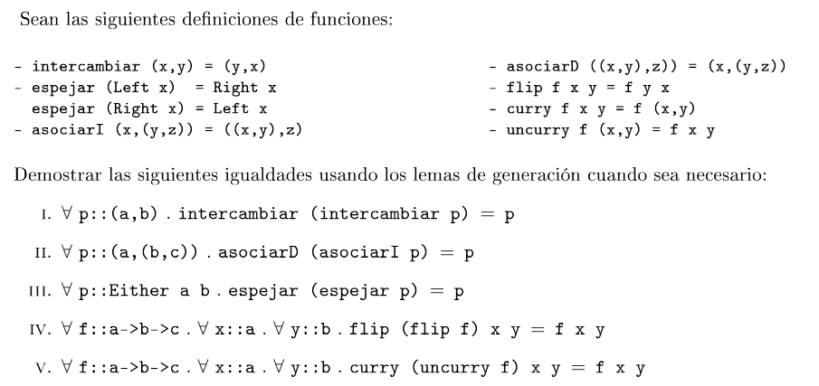
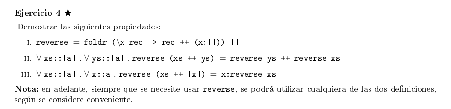
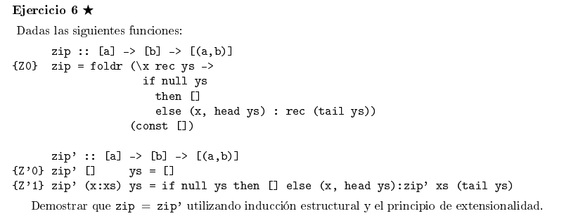
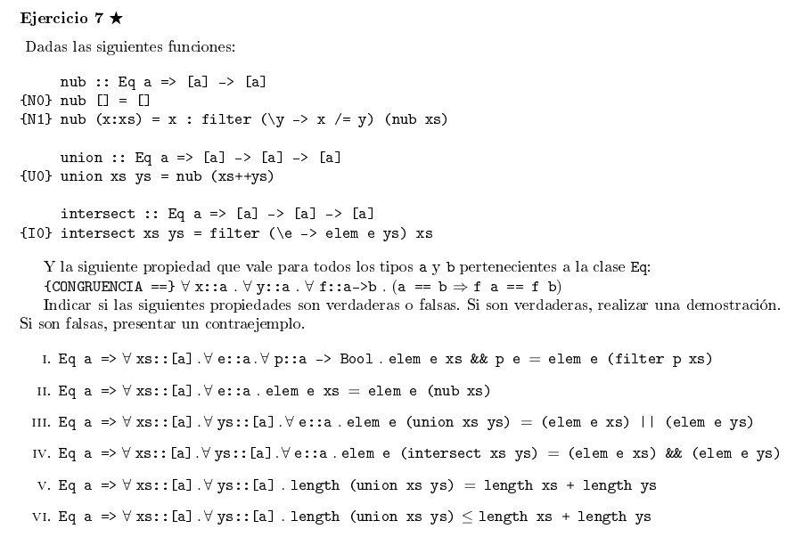
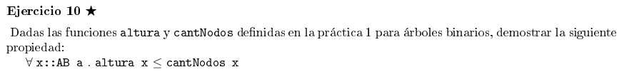

# Razonamiento ecuacional e inducción estructural

## Util

### **Lema de generación para pares**

```
Si p :: (a, b), entonces ∃x :: a. ∃y :: b. p = (x, y)
```

### **Lema de generación para sumas**

```
data Either a b = Left a | Right b

Si e :: Either a b, entonces:
    o bien ∃x :: a. e = Left a
    o bien ∃y :: b. e = Right y
```

### **Principio de extensionalidad funcional**

```
Sean f, g :: a -> b

Si (∀x :: a. f x = g x) ⇒ f = g

⋆ Propiedad inmediata:

Si f = g ⇒ (∀x :: a. f x = g x)

Es decir, se cumple la vuelta.
```

### Definiciones a usar

```haskell
length :: [a] -> Int
{L0} length [] = 0
{L1} length (x:xs) = 1 + length xs

duplicar :: [a] -> [a]
{D0} duplicar [] = []
{D1} duplicar (x:xs) = x : x : duplicar xs

(++) :: [a] -> [a] -> [a]
{++0} [] ++ ys = ys
{++1} (x:xs) ++ ys = x : (xs ++ ys)

append :: [a] -> [a] -> [a]
{A0} append xs ys = foldr (:) ys xs

reverse :: [a] -> [a]
{R0} reverse = foldl (flip (:)) []

{M0} map f []     = []
{M1} map f (x:xs) = f x : map f xs

{F0} filter p [] = []
{F1} filter p (x:xs) = if p x then x : filter p xs else filter p xs

{E0} elem e [] = False
{E1} elem e (x:xs) = (e == x) || elem e xs

{FL0} foldl f z [] = z
{FL1} foldl f z (x:xs) = foldl f (f z x) xs

{FR0} foldr f z [] = z
{FR1} foldr f z (x:xs) = f x (foldr f z xs)

zip :: [a] -> [b] -> [(a, b)]
{Z0} zip = 
    foldr (\x rec ys ->
        if null ys then
            []
        else 
            (x, head ys) : rec (tail ys)
    )
    (const [])

zip' :: [a] -> [b] -> [(a, b)]
{Z'0} zip' [] ys = []
{Z'1} zip' (x:xs) ys = 
    if null ys then 
        [] 
    else 
        (x, head ys) : zip' xs (tail ys)

const :: a -> b -> a
{C} const x _ = x

{β} = (\x -> Y) Z ⟶ Y reemplazando x por Z
```

## Ejercicio 1



### 1. I

Se puede partir de los [lemas de generación](#util), ya que p es un par (∀p :: (a, b)). De acuerdo a esto, puedo escribir a p de la siguiente forma: `∃x :: a. ∃y :: b. p(x, y)`. Por lo tanto:

```haskell
intercambiar(intercambiar (x,y)) = (x,y)
{IN} = intercambiar((y,x)) 
{IN} = (x,y) ⟶ lo que se quería probar

□
```

### 1. II

Voy a definir:

- asociarD ((x,y), z) = (x, (y,z)) = **{D}**
- asociarI (x, (y,z)) = ((x,y) ,z) = **{I}**
  
Nuevamente, por [lemas de generación](#util) puedo reescribir a p como: `∃x :: a. ∃y :: b. ∃z :: c. p(x, (y,z))`. Por lo tanto:

```haskell
asociarD(asociarI (x, (y,z))) = (x, (y,z))
{I} = asociarD((x, y), z)
{D} = (x, (y,z)) ⟶ lo que se quería probar

□
```

### 1. III

Voy a definir:

- espejar (Left x) = Right x = **{R}**
- espejar (Right x) = Left x = **{L}**

Como p es un Either a b, por [lemas de generación](#util), puedo decir que: `o bien ∃x :: a. p = Left a, o bien ∃y :: b. p = Right y`. Por lo tanto:

```haskell
-- Caso left
espejar(espejar (Left a)) = Left a
{R} = espejar(Right b)
{L} = Left a ⟶ lo que se quería probar

-- Caso right
espejar(espejar (Right b)) = Right b
{L} = espejar(Left a)
{R} = Right b ⟶ lo que se quería probar

□
```

Bueno, las resoluciones siguientes (de flip y de curry) son análogas a lo anterior teniendo en cuenta que `∀f:: a -> b -> c, x :: a, y :: b`. No se necesita ningún lema de generación. No voy a escribir todo por falta de tiempo.

## Ejercicio 2


### 2. I

Voy a definir:

- **{ID}** = id x = x
- **{S}** = swap (x, y) = (y, x)
- **{C}** = (g . f) x = g (f x)
- **{F}** = flip f x y = f y x

Por extensionalidad quiero ver que `∀f :: (a -> b -> c). ∀x :: a. ∀y :: b. (flip . (flip f)) x y = (id f) x y`

```haskell
-- Parte izq
(flip . (flip f) x y)
{C} = (flip (flip f) x y)
{F} = (flip f) y x
{F} = f x y

-- Parte der
(id f) x y
{ID} = f x y

□
```

### 2. II

Voy a definir:

- **{CURRY}**   = curry f x y = f (x, y)
- **{UNCURRY}** = uncurry f (x, y) = f x y

Por extensionalidad quiero ver que `∀f :: (a, b) -> c. ∀x :: a. ∀y :: b. (uncurry (curry f) (x,y)) = f (x, y)`

```haskell
uncurry (curry f) (x, y)
{UNCURRY}   = curry f x y
{CURRY}     = f (x, y) ⟶ lo que se quería probar

□
```

### 2. IV

Voy a definir:

- **{C}** = (g . f) x = g (f x)

Primero, aclaro qué tipo va a tener cada argumento de la expresión dada

- `f :: a -> b`
- `g :: b -> c`
- `h :: c -> d`

Por lo tanto:

```haskell
-- Por izq
((h . g) . f) x         -- donde (h . g) = g según def {C}
{C} = (h . g) (f x)
{C} = h (g (f x))

-- Por der
(h . (g . f)) x         -- donde h = g según def {C}
{C} = h ((g . f) x)
{C} = h (g (f x))

□
```

## Inducción sobre listas

## Ejercicio 3

### 3. I

> [Definiciones](#definiciones-a-usar)

Demostración de `∀xs :: [a]. length(duplicar xs) = 2 * length xs`

Defino:

- **P(xs)** = `∀xs :: [a]. length(duplicar xs) = 2 * length xs` 
- **HI** = `length(duplicar xs) = 2 * length xs`

Empiezo por el **caso base**:

```haskell
-- Por izq
length(duplicar [])
{D0} = length([])
{L0} = 0

-- Por der
2 * length []
{L0} = 2 * 0
     = 0

□
```

Ahora, el **paso inductivo**. Asumo que **P(xs)** se cumple, por lo que quiero ver si se cumple **P(x:xs)**
:

```haskell
-- Por izq
length(duplicar x:xs)
{D1} = length(x : x : duplicar xs)      -- tomo x : duplicar xs como xs según def {L1}
{L1} = 1 + length(x : duplicar xs)
{L1} = 1 + 1 + length(duplicar xs)
{HI} = 1 + 1 + 2 * length(xs)
     = 2 + 2 * length(xs)

-- Por der
2 * length (x:xs)
{L1} = 2 * (1 + length(xs))
     = 2 + 2 * length(xs)

□
```

### 3. II

> [Definiciones](#definiciones-a-usar)

Demostración de `∀xs :: [a]. length(xs ++ ys) = length xs + length ys`

Defino:

- **P(xs)** = `∀xs :: [a]. length(xs ++ ys) = length xs + length ys`
- **HI** = `length(xs ++ ys) = length xs + length ys`

**Caso base**:

```haskell
-- Por izq
length([] ++ ys)
{++} = length(ys)

-- Por der
length([]) + length(ys)
{L0} = length(ys)
```

Asumo que **P(xs)** se cumple, por lo que quiero ver si se cumple **P(x:xs)**.

**Paso inductivo**:

```haskell
-- Por izq
length((x:xs) ++ ys)
{++1} = length(x:(xs ++ ys))
{L1}  = 1 + length(xs ++ ys)
{HI}  = 1 + length(xs) + length(ys)
{L1}  = length(x:xs) + length(ys)

-- Por der
length(x:xs) + length(ys)

□
```

### 3. VI

> [Definiciones](#definiciones-a-usar)

Demostración de `∀xs :: [a]. ∀f :: (a -> b). length(map f xs) = length xs`

Defino:

- **P(xs)**: `∀xs :: [a]. ∀f :: (a -> b). length(map f xs) = length xs`
- **HI**: `length(map f xs) = length xs`
  
**Caso base**:

```haskell
-- Por izq
length(map f [])
{M0} = length([])
{L0} = 0

-- Por der
length([])
{L0} = 0

□
```

Asumo que **P(xs)** se cumple, por lo que quiero ver si se cumple **P(x:xs)**.

**Paso inductivo**:

```haskell
-- Por izq
length(map f (x:xs))
{M1} = length(f x : map f xs)       -- fx = x, map f xs = xs según def {L1}
{L1} = 1 + length(map f xs)
{HI} = 1 + length(xs)

-- Por der
length(x:xs)
{L1} = 1 + length(xs)

□
```

### 3. VII

> [Definiciones](#definiciones-a-usar)

Demostración de `∀ xs :: [a] . ∀ p :: a -> Bool . ∀ e :: a . (elem e (filter p xs) ⇒ elem e xs) (si vale Eq a)`

Defino:

- **P(xs)**: `∀ xs :: [a] . ∀ p :: a -> Bool . ∀ e :: a . (elem e (filter p xs) ⇒ elem e xs) (si vale Eq a)`
- **HI**: `(elem e (filter p xs) ⇒ elem e xs)`

**Caso base**:

```haskell
-- Por izq
(elem e (filter p []))
{F0} = elem e ([])

-- Por der
elem e ([])

□
```

Asumo que **P(xs)** se cumple, por lo que quiero ver si se cumple **P(x:xs)**.

**Paso inductivo**:

```haskell
-- Por izq
(elem e (filter p (x:xs)))
{HI} = (elem e (if p x then x : filter p xs else filter p xs))

    -- Caso p x = true
    (elem e (x : filter p xs))
    {E1} = (e == x) || elem e (filter p xs)
        -- Caso e == x
        {E1} = elem e (x:xs)
        -- Caso elem e (filter p xs)
        {HI} = elem e xs
        {E1} = elem e (x:xs)
     
     -- Caso p x = false
     (elem e (filter p (x:xs)))
     {HI} = elem e (x:xs) 

-- Por der
elem e (x:xs)

-- ∴ caso true y false devuelven lo mismo que la parte derecha

□
```

## Ejercicio 4



### 4. I

> [Definiciones](#definiciones-a-usar)

Demostración de ` reverse = foldr (\x rec -> rec ++ (x:[])) []`

Defino:

- **P(xs)** = `reverse = foldr (\x rec -> rec ++ (x:[])) []`
- **HI** = `reverse = foldr (\x rec -> rec ++ (x:[])) []`

**Caso base**:

```haskell
Sé que:
     {R0}   reverse [] = foldl (flip (:)) []
     {FLIP} reverse [] = foldr g []

-- Lado izq
reverse []
{R0} = []

-- Lado der
foldr g [] []
{FR0} = []

□
```

Asumo que **P(xs)** se cumple, por lo que quiero ver si se cumple **P(x:xs)**.

**Paso inductivo**:

```haskell
Sé que:
     {R1}   reverse xs = foldl (flip (:)) xs
     {FLIP} reverse xs = foldr g [] xs

-- Lado izq
reverse xs
{R1} = 
```

Lo anterior está incompleto (y probablemente mal), lo dejo para después

## Ejercicio 6



Demostración de `zip = zip'` por **inducción estructural** y **principio de extensionalidad**

### Definiciones a usar

```haskell
zip :: [a] -> [b] -> [(a, b)]
{Z0} zip = 
    foldr (\x rec ys ->
        if null ys then
            []
        else 
            (x, head ys) : rec (tail ys)
    )
    (const [])

zip' :: [a] -> [b] -> [(a, b)]
{Z’0} zip' [] ys = []
{Z’1} zip' (x:xs) ys = 
    if null ys then 
        [] 
    else 
        (x, head ys) : zip' xs (tail ys)

foldr :: (a -> b -> b) -> b -> [a] -> b
{FR0} foldr f z [] = z
{FR1} foldr f z (x:xs) = f x (foldr f z xs)

const :: a -> b -> a
{C} const x _ = x
```

Por principio de extensionalidad, basta ver que ambas funciones van a generar la misma imagen ∀ posible argumento. 

Defino:

- `∀xs :: [a]. P(xs) = ∀ys :: [b]. zip xs ys = zip' xs ys`
- **{HI}** = `zip xs ys = zip' xs ys`

**Caso base**:

```haskell
-- Lado izq
zip [] ys =
     (foldr (\x rec ys ->                         -- | todo esto sería f
          if null ys then                         -- |
               []                                 -- |    
          else                                    -- |
               (x, head ys) : rec (tail ys)       -- |
          )                                       -- |
          (const []) []) ys                       -- | (const []) = z ∧ [] = (x:xs) ya que xs = []
{FR0} = (const[]) ys
{C}   = []

-- Lado der
zip' [] ys 
{Z'0} = []

□
```

Asumo que **P(xs)** se cumple, por lo que quiero ver si se cumple **P(x':xs)**.

**Paso inductivo**:

```haskell
-- Leer bien porque es realmente un quilombo

-- Lado izq
zip :: [a] -> [b] -> [(a, b)]
     zip = 
    foldr (\x rec ys ->
        if null ys then
            []
        else 
            (x, head ys) : rec (tail ys)
    )
    (const [] (x:xs)) ys
{FR1} = (\x rec ys ->
        if null ys then
            []
        else 
            (x, head ys) : rec (tail ys)
    ) x' (foldr (\x rec ys ->
        if null ys then
            []
        else 
            (x, head ys) : rec (tail ys)
    ) (const []) xs) ys
{β}   = (\rec ys ->
        if null ys then
            []
        else 
            (x', head ys) : rec (tail ys)
    ) (foldr (\x rec ys ->
        if null ys then
            []
        else 
            (x, head ys) : rec (tail ys)
    ) (const []) xs) ys
{β}   = (\ys ->
        if null ys then
            []
        else 
            (x', head ys) : ((foldr (\x rec ys ->
        if null ys then
            []
        else 
            (x, head ys) : rec (tail ys)
    ) (const []) xs) (tail ys)
    )) ys
{β}   = (
        if null ys then
            []
        else 
            (x', head ys) : (foldr (\x rec ys ->
        if null ys then
            []
        else 
            (x, head ys) : rec (tail ys)
    ) (const []) xs) (tail ys)
    )

-- Lado der
zip' (x':xs) ys
{Z’1} = (x':xs) ys = 

-- Separo en dos casos, según null ys = true ó null ys = false

     -- null ys = True
     
          -- Lado izq
          {Bool} = (
              if TRUE then
                  []
              else 
                  (x', head ys) : (foldr (\x rec ys ->
              if null ys then
                  []
              else 
                  (x, head ys) : rec (tail ys)
          ) (const []) xs) (tail ys)
          )
          {Bool} = []

          -- Lado der
          {Bool} = if TRUE then [] else (x', head ys) : zip' xs (tail ys)
          {Bool} = []
     
     -- null ys = False
          
          -- Lado izq
          {Bool} = (
              if FALSE then
                  []
              else 
                  (x', head ys) : (foldr (\x rec ys ->
              if null ys then
                  []
              else 
                  (x, head ys) : rec (tail ys)
          ) (const []) xs) (tail ys)
          )
          {Bool} = else 
                  (x', head ys) : (foldr (\x rec ys ->
              if null ys then
                  []
              else 
                  (x, head ys) : rec (tail ys)
          ) (const []) xs) (tail ys)
          {Z0}   = (x', head ys): (zip xs (tail ys))
          {HI}   = (x', head ys): (zip' xs (tail ys))

          -- Lado der
          {Bool} = if FALSE then [] else (x', head ys) : zip' xs (tail ys)
          {Bool} = (x', head ys) : zip' xs (tail ys)

-- ∴ quedó probado porque tanto el caso True como el False dieron lo mismo. 

          □
```

## Ejercicio 7



### Definiciones a usar

```haskell
nub :: Eq a => [a] -> [a]
{N0} nub [] = []
{N1} nub (x:xs) = x : filter (\y -> x /= y) (nub xs)

union :: Eq a => [a] -> [a] -> [a]
{U0} union xs ys = nub (xs++ys)

intersect :: Eq a => [a] -> [a] -> [a]
{I0} intersect xs ys = filter (\e -> elem e ys) xs
```

```haskell
filter :: (a -> Bool) -> [a] -> [a]
{F0} filter p [] = []
{F1} filter p (x:xs) = if p x then x : filter p xs else filter p xs

elem :: Eq a => a -> [a] -> Bool
{EL0} elem _ []     = False
{EL1} elem e (x:xs) = (e == x) || elem e xs

válida ∀a, b ∈ class Eq
{CONGRUENCIA ==} ∀ x::a . ∀ y::a . ∀ f::a->b . (a == b ⇒ f a == f b)
```

### 7. I

QVQ `Eq a => ∀ xs::[a] . ∀ e::a . ∀ p::a -> Bool . elem e xs && p e = elem e (filter p xs)`.

Al estar queriendo probar algo sobre listas, voy a usar *inducción estructural sobre listas*.

Defino:

- **P(xs)** = `∀ e::a . ∀ p::a -> Bool . elem e xs && p e = elem e (filter p xs)`
- **{HI}** = `elem e xs && p e = elem e (filter p xs)`

**Caso base**:

```haskell
-- Lado izq
elem e [] && p e 
{EL0} = False && p e 
{&&}  = False

-- Lado der
elem e (filter p [])
{F0}  = elem e []
{EL0} = False

□
```

Asumo que **P(xs)** se cumple, por lo que quiero ver si se cumple **P(x:xs)**.

**Paso inductivo**:

```haskell
-- Lado izq 
elem e (x:xs) && p e 
{EL1} = ((e == x) || elem e xs) && p e 

-- Lado der
elem e (filter p (x:xs))
{F1} = elem e (if p x then x : filter p xs else filter p xs)

-- Separo en dos casos, según (e == x) = true ó (e == x) = false

     -- (e == x) = true (en este caso, como e == x, asumo que p e == p x). ✓

          -- Lado izq
          {EL1}  = ((e == x) || elem e xs) && p e 
          {Bool} = (TRUE || elem e xs) && p e
          {||}   = TRUE && p e

          -- Lado der
          {F1} = elem e (if p x then x : filter p xs else filter p xs)

               -- Caso p e = True ✓
                    
                    -- Lado izq
                    {||}   = TRUE && p e
                    {Bool} = True && True 
                    {&&}   = True 
                    
                    -- Lado der
                    {F1}   = elem e (if p x then x : filter p xs else filter p xs)
                    {Bool} = elem e (if TRUE then x : filter p xs else filter p xs)
                    {Bool} = elem e (x : filter p xs)
                    {EL1}  = (e == x) || elem e (filter p xs)
                    {Bool} = TRUE || elem e (filter p xs)
                    {Bool} = True
               
               -- Caso p e = False ✓

                    -- Lado izq
                    {||}   = FALSE && p e
                    {Bool} = False && True 
                    {&&}   = False

                    -- Lado der
                    {F1}   = elem e (if p x then x : filter p xs else filter p xs)
                    {Bool} = elem e (if FALSE then x : filter p xs else filter p xs)
                    {Bool} = elem e (filter p xs)
                    {HI}   = elem e xs && p e
                    {Bool} = elem e xs && False
                    {Bool} = False          

     -- (e == x) = false ✓
          
          -- Lado izq
          {EL1}  = ((e == x) || elem e xs) && p e 
          {Bool} = (FALSE || elem e xs) && p e
          {||}   = (elem e xs) && p e

          -- Lado der
          {F1} = elem e (if p x then x : filter p xs else filter p xs)

               -- Caso p e = true ∧ p x = true ✓

                    -- Lado izq
                    {||}   = (elem e xs) && p e
                    {HI}   = elem e (filter p xs)

                    -- Lado der
                    {F1}   = elem e (if p x then x : filter p xs else filter p xs)
                    {Bool} = elem e (x : filter p xs)
                    {EL1}  = (e == x) || elem e (filter p xs)
                    {Bool} = elem e (filter p xs)

               -- Caso p e = true ∧ p x = false ✓
               
                    -- Lado izq
                    {||}   = (elem e xs) && p e
                    {HI}   = elem e (filter p xs)

                    -- Lado der
                    {F1}   = elem e (if p x then x : filter p xs else filter p xs)
                    {Bool} = elem e (filter p xs)

               -- Caso p e = false ∧ p x = true ✓

                    -- Lado izq
                    {||} = (elem e xs) && p e
                    {HI} = elem e (filter p xs)

                    -- Lado der
                    {F1}   = elem e (if p x then x : filter p xs else filter p xs)
                    {Bool} = elem e (x : filter p xs)
                    {EL1}  = (e == x) || elem e (filter p xs)
                    {Bool} = elem e (filter p xs)

               -- Caso p e = false ∧ p x = false ✓

                    -- Lado izq
                    {||} = (elem e xs) && p e
                    {HI} = elem e (filter p xs)

                    -- Lado der
                    {F1}   = elem e (if p x then x : filter p xs else filter p xs)
                    {Bool} = elem e (filter p xs)
```

### 7. III

QVQ `Eq a => ∀ xs::[a] . ∀ ys::[a] . ∀ e::a . elem e (union xs ys) = (elem e xs) || (elem e ys)`

Defino:

- **P(xs)** = `∀ ys::[a] . ∀ e::a . elem e (union xs ys) = (elem e xs) || (elem e ys)`
- **{HI}** = `elem e (union xs ys) = (elem e xs) || (elem e ys)`
- **{I2}** = `elem e xs = elem e (nub xs)`, que es lo que se plantea en el inciso 2 ★


```haskell
-- Lado izq

elem e (union [] ys)
{U0} = elem e (nub ([]++ys)) 
{++} = elem e (nub ys)
{I2} = elem e ys

-- Lado der
(elem e []) || (elem e ys)
{EL0}  = False || (elem e ys)
{Bool} = elem e ys

□
```

Asumo que **P(xs)** se cumple, por lo que quiero ver si se cumple **P(x:xs)**.

**Paso inductivo**:

```haskell
-- Lado izq

elem e (union (x:xs) ys)
{U0} = elem e (nub ((x:xs)++ys))
{I2} = elem e ((x:xs)++ys)

-- Lado der
(elem e (x:xs)) || (elem e ys)
{≟} = elem e ((x:xs)++ys)

□
```

***[!]*** Tengo que probar **≟**, por lo que sigo el mismo procedimiento que antes:

QVQ `(elem e (x:xs)) || (elem e ys) = elem e ((x:xs)++ys)`

**Caso base**

```haskell
-- Lado izq
elem [] || (elem e ys)
{EL0} = False || (elem e ys)
{||}  = (elem e ys)

-- Lado der
elem e (([])++ys)
{++} = elem e ys

□
```

Asumo que **P(xs)** se cumple, por lo que quiero ver si se cumple **P(x:xs)**.

**Paso inductivo**:

```haskell
-- Lado izq
(elem e (x:xs)) || (elem e ys)
{EL1} = e == x || elem e xs || elem e ys

-- Lado der
elem e ((x:xs)++ys)
{++}  = elem e(x:(xs++ys))
{EL1} = e == x || elem e (xs++ys)
{HI}  = e == x || elem e xs || elem e ys

□
```

## Otros tipos de estructuras

## Ejercicio 10



Dado lo siguiente

```haskell
foldAB :: b -> (b -> a -> b -> b) -> AB a -> b
{F} foldAB cNil fBin ab =
    case ab of
        Nil       -> cNil
        Bin i r d -> fBin (foldABRec i) r (foldABRec d) 
    where foldABRec = foldAB cNil fBin

altura :: AB a -> Integer
{A} altura ab = foldAB 0 (\alturaI _ alturaD -> 1 + max alturaI alturaD) ab

cantNodos :: AB a -> Integer
{N} cantNodos ab = foldAB 0 (\nodosI _ nodosD -> 1 + nodosI + nodosD) ab
```

Se quiere demostrar: `∀x :: AB a. altura x ≤ cantNodos x`

Para este caso voy a usar, nuevamente, inducción estructural pero en vez de sobre listas será sobre un *arbol*. El objetivo es demostrarlo `∀ t :: AB`, es decir, para todo arbol t de tipo AB.

Defino:

- **P(x)** = ∀x :: AB a. altura x ≤ cantNodos x
- **{HI}** = altura x ≤ cantNodos x

> Rec: Nil = [], ∀ t :: AB

**Caso base**: (P(Nil))

```haskell
-- Lado izq

altura Nil 
{A}       = foldAB 0 (\alturaI _ alturaD -> 1 + max alturaI alturaD) Nil
{F}       = case Nil of
           Nil       -> 0
            Bin i r d -> (\alturaI _ alturaD -> 1 + max alturaI alturaD) (foldABRec i) r (foldABRec d) 
          where foldABRec = foldAB 0 (\alturaI _ alturaD -> 1 + max alturaI alturaD)
{caseNil} = 0

-- Lado der
cantNodos Nil
{N}       = foldAB 0 (\nodosI _ nodosD -> 1 + nodosI + nodosD) Nil
{F}       = case Nil of
              Nil       -> 0
              Bin i r d -> (\nodosI _ nodosD -> 1 + nodosI + nodosD) (foldABRec i) r (foldABRec d) 
            where foldABRec = foldAB 0 (\nodosI _ nodosD -> 1 + nodosI + nodosD)
{caseNil} = 0

□
```

Asumo que **P(i)** y **P(d)** se cumplen, por lo que quiero ver si se cumple **P(Bin i r d)**.

**Paso inductivo**:

```haskell
-- Lado izq

altura (Bin i r d)
{A}       = foldAB 0 (\alturaI _ alturaD -> 1 + max alturaI alturaD) (Bin i r d)
{F}       = case ab of
            Nil       -> 0
            Bin i r d -> (\alturaI _ alturaD -> 1 + max alturaI alturaD) (foldABRec i) r (foldABRec d) 
          where foldABRec = foldAB 0 (\alturaI _ alturaD -> 1 + max alturaI alturaD)
{caseBin} = (\alturaI _ alturaD -> 1 + max alturaI alturaD) (foldABRec i) r (foldABRec d) 
          where foldABRec = foldAB 0 (\alturaI _ alturaD -> 1 + max alturaI alturaD)
{β}       = (\_ alturaD -> 1 + max (foldABRec i) alturaD) r (foldABRec d) 
          where foldABRec = foldAB 0 (\alturaI _ alturaD -> 1 + max alturaI alturaD)
{β}       = (\alturaD -> 1 + max (foldABRec i) alturaD) (foldABRec d) 
          where foldABRec = foldAB 0 (\alturaI _ alturaD -> 1 + max alturaI alturaD)
{β}       = 1 + max (foldABRec i) (foldABRec d)
          where foldABRec = foldAB 0 (\alturaI _ alturaD -> 1 + max alturaI alturaD)
{where}   = 1 + max (foldAB 0 (\alturaI _ alturaD -> 1 + max alturaI alturaD) i) (foldAB 0 (\alturaI _ alturaD -> 1 + max alturaI alturaD) d)
{A}       = 1 + max (altura i) (foldAB 0 (\alturaI _ alturaD -> 1 + max alturaI alturaD) d)
{A}       = 1 + max (altura i) (altura d)
{Int}     ≤ 1 + (altura i) + (altura d)                     -- acá {Int} es la prop: max(a, b) ≤ a + b
{HI}      ≤ 1 + (cantNodos i) + (cantNodos d)

-- Lado der

cantNodos (Bin i r d)
{C}       = foldAB 0 (\nodosI _ nodosD -> 1 + nodosI + nodosD) (Bin i r d)
{F}       = case (Bin i r d) of
            Nil       -> 0
            Bin i r d -> (\nodosI _ nodosD -> 1 + nodosI + nodosD) (foldABRec i) r (foldABRec d) 
          where foldABRec = foldAB 0 (\nodosI _ nodosD -> 1 + nodosI + nodosD)
{caseBin} = (\nodosI _ nodosD -> 1 + nodosI + nodosD) (foldABRec i) r (foldABRec d) 
          where foldABRec = foldAB 0 (\nodosI _ nodosD -> 1 + nodosI + nodosD)
{β}       = (\_ nodosD -> 1 + (foldABRec i) + nodosD) r (foldABRec d) 
          where foldABRec = foldAB 0 (\nodosI _ nodosD -> 1 + nodosI + nodosD) 
{β}       = (\nodosD -> 1 + (foldABRec i) + nodosD) (foldABRec d) 
          where foldABRec = foldAB 0 (\nodosI _ nodosD -> 1 + nodosI + nodosD) 
{β}       = 1 + (foldABRec i) + (foldABRec d)
          where foldABRec = foldAB 0 (\nodosI _ nodosD -> 1 + nodosI + nodosD)
{where}   = 1 + (foldAB 0 (\nodosI _ nodosD -> 1 + nodosI + nodosD)  i) + (foldAB 0 (\nodosI _ nodosD -> 1 + nodosI + nodosD)  d)
{C}       = 1 + (cantNodos i) + (foldAB 0 (\nodosI _ nodosD -> 1 + nodosI + nodosD)  d)
{C}       = 1 + (cantNodos i) + (cantNodos d)

□
```

Debido a lo anterior se llegó a dos cosas:

- **{★₁}** `altura (Bin i r d) ≤ 1 + (cantNodos i) + (cantNodos d)`
- **{★₂}** `cantNodos (Bin i r d) = 1 + (cantNodos i) + (cantNodos d)`

Por lo tanto, se puede ver que:

```haskell
altura (Bin i r d) ≤ 1 + (cantNodos i) + (cantNodos d)
{★₂} ⇒ altura (Bin i r d) ≤ cantNodos (Bin i r d)
```
Que es lo que quería probar.

Además, de acuerdo a la HI puedo ver que:

```haskell
1 + (cantNodos i) + (cantNodos d)
{HI} ≥ 1 + (altura i) + (altura d)
```

∴ queda probado lo que quería.
