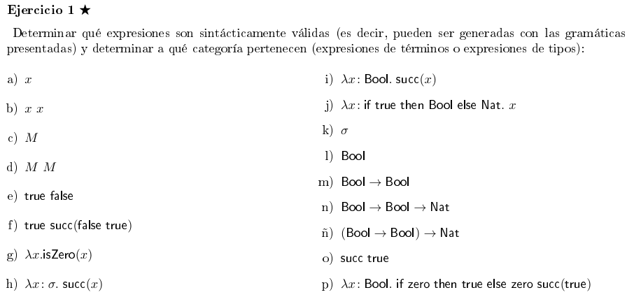
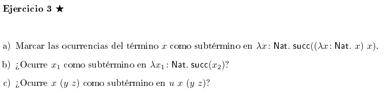
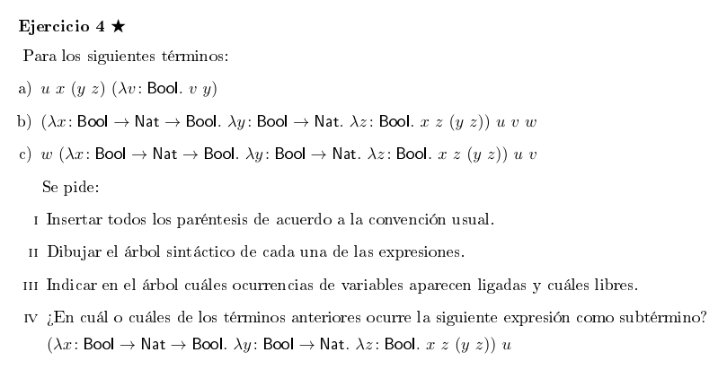
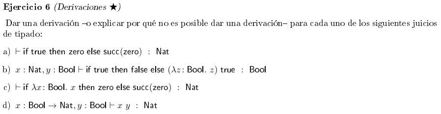
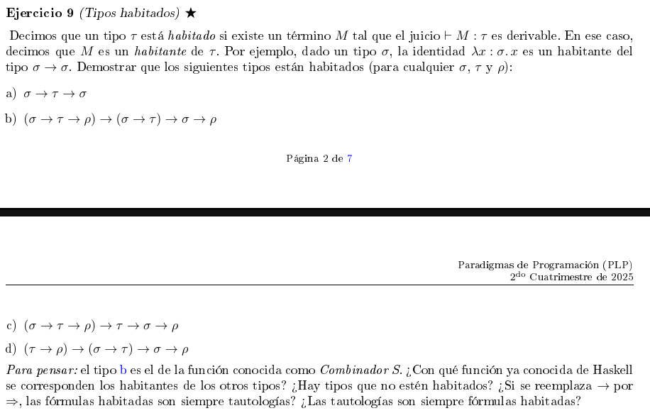
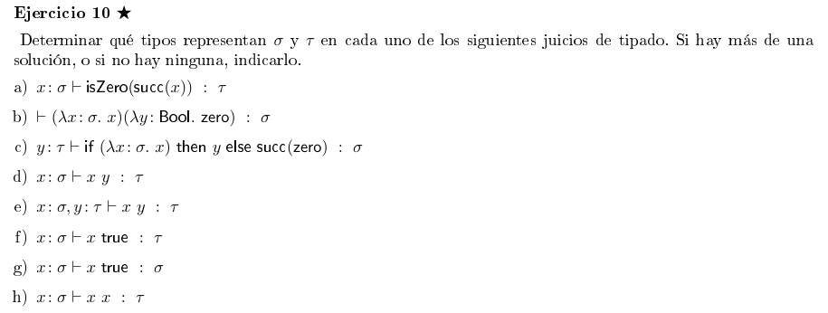
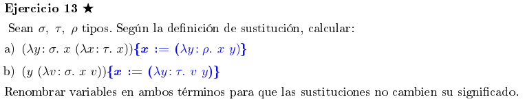
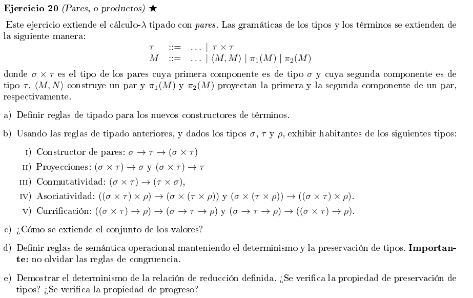

# Cálculo λ - Tipado y semántica operacional

## Ejercicio 1



- **a.** Expresión válida: de término
- **b.** Expresión válida: de término. Es una aplicación.
- **c.** Expresión inválida: de término. Es una metavariable de la gramática
- **d.** Expresión inválida: de término. Nuevamente, así como *solo* una metavariable es inválida, la aplicación de metavariables también lo es.
- **e.** Expresión válida: de términos. Si bien parece incoherente, está bien formada, por lo que es válida.
- **f.** Expresión válida: de términos. Tipos bien formados.
- **g.** Expresión inválida: de términos. La expresión tiene que se algo de la forma `λx : τ. isZero(x)`, pero el tipo no está aclarado, por lo que es una lambda sintácticamente incorrecta.
- **h.** Expresión válida: de términos. Se corrige lo anteriormente indicado, ya que σ denota un *tipo*.
- **i.** Expresión válida: de términos. Nuevamente, se indica bien el tipo de la lambda. Igualmente, esto no tipa ya que Succ espera un `Nat` (creo).
- **j.** Expresión inválida: de términos. Lo que toma el lugar de τ debería ser un *tipo*, pero `if true then Bool else Nat` sería una construcción de un término, no un tipo.
- **k.** Expresión válida: de tipo. σ es un tipo, no hay mucho más que decir (?)
- **l.** Expresión válida: de tipo. Idem k.
- **m.** Expresión válida: de tipo. Idem k.
- **n.** Expresión válida: de tipo. Idem k.
- **ñ.** Expresión válida: de tipo. idem k.
- **o.** Expresión inválida: de tipo. Debería escribirse `succ(true)`. Igualmente, esto no tiparía porque Succ espera un `Nat` (creo).
- **p.** Expresión válida: de término. Es una construcción correcta de un término.

## Ejercicio 3



### 3. a

$$λx : Nat. succ((λx : Nat. [x]) [x])$$

- x tiene *dos* ocurrencias. Notar que las x ligadoras **no** son apariciones, sino solamente las ligadas/libres (en este caso, no hay libres)

### 3. b

$$λx_1 : Nat. succ(x_2)$$

No, $x$₁ **no ocurre como subtérmino**, nunca aparece como subtérmino libre o ligado aunque esté declarado en la lambda.

### 3. c

$$u x (y z)$$

La expresión dada se parsea como $(u x)(y z)$, ya que la asociativiad en la aplicación de funciones es hacia la izquierda. Por lo tanto, $x (y z)$ **nunca ocurre como subtérmino**, debido a que si $(u x) = j$ ⇒ la expresión sería una aplicación del estilo $j (y z)$ con $j$ ≠ $(u x)$.

## Ejercicio 4



### 4. a

$$(u \ x)(y \ z)(λv:Bool. \ v \ y)$$

Voy a renombrar a la $y$ dentro la lambda como $n$ ya que la $y$ ∈ $(y \ z)$ ≠ $y$ ∈ $(λv:Bool. \ v \ y)$

```haskell
(u x)(y z) (λv : Bool. v n)
    |             |
    v             v
(u x)(y z)    (λv : Bool. v n)
  |     |          | -- por λ
  v     v          v
(u x)   (y z)    (v n)
|   |   |   |    |   |
v   v   v   v    v   v
u   x   y   z    v   n
```

La única variable ligada es $v$, las demás ($u$, $x$, $y$, $z$, $n$) son libres.

### 4. b

$$(((λx : Bool → Nat → Bool. λy : Bool → Nat. \ λz : Bool. (x \ z) (y \ z)) \ u) \ v) \ w$$

```haskell
(((λx : Bool → Nat → Bool. λy : Bool → Nat. λz : Bool. (x z) (y z)) u) v) w
                        |                                                 |
                        v                                                 v
((λx : Bool → Nat → Bool. λy : Bool → Nat. λz : Bool. (x z) (y z)) u) v   w       
                        |                                             |
                        v                                             v
(λx : Bool → Nat → Bool. λy : Bool → Nat. λz : Bool. (x z) (y z)) u   v
                        |                                          |
                        v                                          v
(λx : Bool → Nat → Bool. λy : Bool → Nat. λz : Bool. (x z) (y z))  u                  
                        | -- por λ
                        v
(λy : Bool → Nat. λz : Bool. (x z) (y z))
            | -- por λ
            v
(λz : Bool. (x z) (y z))
        |
        v
   (x z) (y z)
     |     |
     v     v
   (x z)  (y z)
   |   |   |  |
   v   v   v  v
   x   z   y  z
```

Las variables ligadas son $x$, $z$ e $y$. $u$, $v$ y $w$ son variables libres.

### 4. c

Este punto es prácticamente lo mismo que el anterior, por lo que lo voy a skipear.

## Tipado

## Ejercicio 6 (derivaciones)



### 6. a

```haskell 
                                                       --------------- T-ZERO
                                                       ∅ ⊢ Zero : Nat
---------------- T-TRUE     --------------- T-ZERO  ---------------------
∅ ⊢ true : Bool            ∅ ⊢ zero : Nat         ∅ ⊢ succ(Zero) : Nat
---------------------------------------------------------------------------- T-IF
        ∅ ⊢ if true then zero else succ(Zero) : Nat
```

### 6. b

```haskell
                                                      ---------------------- T-VAR
                                                      Γ, z : Bool ⊢ z : Bool                                                         
                                                      -------------------------------- T-ABS   --------------- T-TRUE
                                                      Γ ⊢ (λz : Bool. z) : Bool → Bool         Γ ⊢ true : Bool
---------------- T-TRUE   ---------------- T-FALSE    -------------------------------------------------------- T-APP
Γ ⊢ true : Bool           Γ ⊢ false : Bool            Γ ⊢ (λz : Bool. z) true : Bool
-------------------------------------------------------------------------------------------- T-IF
                    x : Nat, y : Bool ⊢ if true then false else (λz : Bool. z) true : Bool
```

### 6. c

```haskell
                                                    --------------- T-ZERO
      [ERROR]                                       ∅ ⊢ Zero : Nat
-------------------      --------------- T-ZERO   ---------------------
∅ ⊢ (λx : Bool. x)      ∅ ⊢ zero : Nat          ∅ ⊢ succ(Zero) : Nat
---------------------------------------------------------------------------------- T-IF
               ∅ ⊢ if λx : Bool. x then zero else succ(Zero) : Nat
```

Esta es inválida porque `(λx : Bool. x)` debería esr de tipo *Bool* según la regla T-IF pero no lo es, es de tipo *Bool → Bool*.

### 6. d

```haskell
------------------ T-VAR    ------------ T-VAR
Γ ⊢ x : Bool → Nat          Γ ⊢ y : Bool
----------------------------------------------------------- T-APP
          Γ = {x : Bool → Nat, y : Bool} ⊢ x y : Nat
```

## Ejercicio 9



### 9. b

Quiero demostrar que el siguiente tipo está habitado: `(σ → τ → ρ) → (σ → τ) → σ → ρ`

Puedo pensar cada conjunto de tipos conectados por flechas como una función que toma los valores del tipo correspondiente y devuelve algo del tipo que correcto.

Defino:

- f :: (σ → τ → ρ)
- g :: (σ → τ)
- Los parámetros de tipo σ y ρ quedan como están

Planteo la siguiente expresión:

`(λf : (σ → τ → ρ). λg : (σ → τ). λx : σ. f x (g x)) : (σ → τ → ρ) → (σ → τ) → σ → ρ`

```haskell

----------------- T-VAR    --------- T-VAR             ------------- T-VAR   --------- T-VAR
Γ ⊢ f : σ → τ → ρ          Γ ⊢ x : σ                   Γ ⊢ g : σ → τ         Γ ⊢ x : σ 
------------------------------------- T-APP           -------------------------------- T-APP
        Γ ⊢ f x : τ → ρ                                            Γ ⊢ g x : τ
------------------------------------------------------------------------------- T-APP
            Γ = {f : (σ → τ → ρ), λg : (σ → τ), λx : σ} ⊢ f x (g x) : ρ
---------------------------------------------------------------------------------- T-ABS
            f : (σ → τ → ρ), λg : (σ → τ) ⊢ (λx : σ. f x (g x)) : σ → ρ
--------------------------------------------------------------------------------------------- T-ABS
            f : (σ → τ → ρ) ⊢ (λg : (σ → τ). λx : σ. f x (g x)) : (σ → τ) → σ → ρ
--------------------------------------------------------------------------------------------------------- T-ABS
            (λf : (σ → τ → ρ). λg : (σ → τ). λx : σ. f x (g x)) : (σ → τ → ρ) → (σ → τ) → σ → ρ

```

## Ejercicio 10



### 10. a

```haskell
     --------------- T-VAR
     x : σ ⊢ x : Nat
  --------------------- T-SUCC
  x : σ ⊢ succ(x) : Nat
--------------------------- T-ISZERO
x : σ ⊢ isZero(succ(x)) : τ
```

De acuerdo a las reglas, τ debe ser `Bool` y σ `Nat`

### 10. b

```haskell
----------------- T-VAR          ------------------------- T-VAR
∅, x : σ ⊢ x : σ                ∅, y : Bool ⊢ zero : Nat             {2}
------------------------ T-ABS   ----------------------------- T-ABS
∅ ⊢ (λx : σ. x) : σ → σ         ∅ ⊢ (λy : Bool. zero) : Bool         {1}
-------------------------------------------------------------- T-APP
             ∅ ⊢ (λx : σ. x)(λy : Bool. zero) : σ
```

De acuerdo a la definición de *T-ABS*, como se puede ver en los pasos de {1} y {2}, si `(λy : Bool. zero) : Bool` ⇒ `σ :: Bool → Nat`

### 10. c

```haskell

     [ERROR]                                          ------------------ T-VAR
y̶ ̶:̶ ̶τ̶,̶ ̶x̶ ̶:̶ ̶σ̶ ̶⊢̶ ̶x̶ ̶:̶ ̶τ̶  ★₁                              y : τ ⊢ zero : Nat ★₃
------------------------- T-ABS  ------------- T-VAR  ---------------------- T-SUCC
y : τ ⊢ (λx : σ. x): Bool        y : τ ⊢ y : σ  ★₂    y : τ ⊢ succ(zero) : σ
---------------------------------------------------------------------------- T-IF
              y : τ ⊢ if (λx : σ. x) then y else succ(zero) : σ
```

- Por ★₂, τ = σ. Por ★₃, τ = `Nat` ⇒ τ = σ = `Nat`
- Por ★₁, τ = σ y además `y : τ ⊢ (λx : σ. x) : σ → σ`, pero para cumplir esto, (σ → σ) :: Bool. Esto último se contradice con ★₃.

**∴ Hay un error en la expresión original**

## Semántica

## Ejercicio 13

> Rec: La operación de reemplazo se aplica *solo* sobre las varaibles libres, no las ligadas, por lo que voy a renombrar las ligadas para tener mayor claridad y no confundirme.



### 13. a

Debo reemplazar `{x := (λy : ρ. x y)}` en `(λy : σ. x (λx : τ. x))`

Renombro: `(λz : σ. x (λw : τ. w))` --- M{x := n} ⟶ `(λz : σ. (λy : ρ. x y) (λw : τ. w))`

### 13. b

Debo reemplazar `{x := (λy : τ. v y)}` en `(y (λv : σ. x v))`

Renombro: `(y (λz : σ. x z))` --- M{x := n} ⟶ `(y (λz : σ. (λy : τ. v y) z))`

## Ejercicio 20

### 20. a



#### ¿Qué es una regla de tipado?

> Se llama regla de tipado a aquella que dado un término, permite saber el tipo del mismo.

- Un par es de tipo `σ x τ`, siendo el primero elemento de tipo `σ` y el segundo elemento de tipo `τ`. A la regla que permite saber el tipo de cada uno la llamaré **T-PAR**.
  
  ```haskell
   Γ ⊢ fst : σ      Γ ⊢ snd : τ
  -------------------------- T-PAR
    Γ ⊢ (fst, snd) : σ x τ
  ```

- Teniendo en cuenta lo que especifiqué anteriormente de acuerdo a los tipos de cada componente del par y al tipo del par, también puedo definir reglas de tipado para obtener el tipo del primer y el segundo componente. Es básicamente lo inverso a lo anterior.
  
  ```haskell
   Γ ⊢ P : σ x τ           Γ ⊢ P : σ x τ
  --------------- T-fst    --------------- T-snd
    Γ ⊢ fst : σ               Γ ⊢ fst : τ
  ```

### 20. b

#### ¿Qué es exhibir un habitante?

> Un habitante de un tipo es un término que puede *derivarse* con ese tipo según las reglas de tipado.

En este caso, voy a derivar solamente la el primer tipo de la expresión dada en el inciso **IV** por cuestiones de tiempo, pero el procedimiento es análogo para todas las expresiones dadas.

Me dan algo con el siguiente tipo: `((σ × τ) × ρ) → (σ × (τ × ρ))`, por lo que abajo voy a definir una serie de valores para tener de guía

- `P :: ((σ × τ) × ρ)`
  - `fst(P) :: (σ × τ)`
  - `snd(P) :: ρ`
- `fst(fst(P)) :: σ`
- `snd(fst(P)) :: τ`

Entonces, teniendo esto en cuenta, puedo armar los tipos de salida

- `(snd(fst(P)), snd(P)) :: (τ × ρ)`
- `(fst(fst(P)), (snd(fst(P)), snd(P))) :: ((σ × τ) × ρ)`

Solamente me queda abstraer la expresión

`λP : ((σ × τ) × ρ). (fst(fst(P)), (snd(fst(P)), snd(P))) : ((σ × τ) × ρ) → (σ × (τ × ρ))`

Ahora sí ya se puede pasar a la derivación

```haskell
                               --------------------- T-VAR
                               Γ ⊢ P : ((σ × τ) × ρ)
--------------------- T-VAR    ------------------ T-fst   --------------------- T-VAR
Γ ⊢ P : ((σ × τ) × ρ)          Γ ⊢ fst(P) : σ × τ         Γ ⊢ P : ((σ × τ) × ρ)
------------------ T-fst       ------------------- T-snd  -------------- T-snd
Γ ⊢ fst(P) : σ × τ             Γ ⊢ snd(fst(P)) : τ        Γ ⊢ snd(P) : ρ
------------------- T-fst     ------------------------------------------- T-PAR
Γ ⊢ fst(fst(P)) : σ               Γ ⊢ (snd(fst(P)), snd(P)) : (τ × ρ)
------------------------------------------------------------------------------- T-PAR
Γ = {P : ((σ x τ), x ρ)} ⊢ (fst(fst(P)), (snd(fst(P)), snd(P))) : (σ × (τ × ρ))
---------------------------------------------------------------------------------------------- T-ABS
∅ ⊢ λP : ((σ x τ), x ρ). (fst(fst(P)), (snd(fst(P)), snd(P))) : ((σ × τ) × ρ) → (σ × (τ × ρ))
```