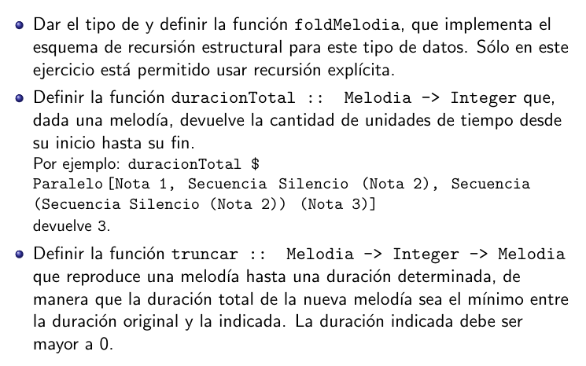
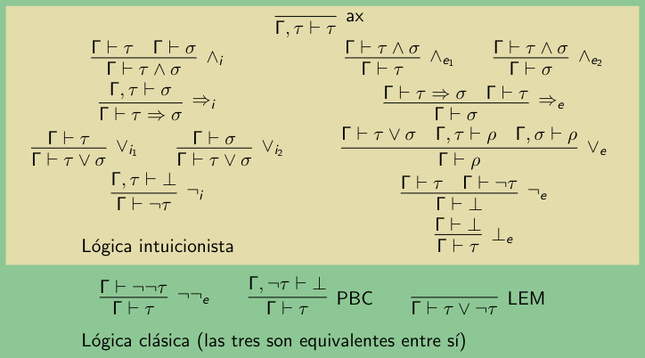

# Clase preparcial

## Ejercicio 1 - Programación funcional

Se tiene el siguiente tipo de dato, llamado Melodia:

```haskell
type Tono = Integer

data Melodia = Silencio
     | Nota Tono
     | Secuencia Melodia Melodia
     | Paralelo [Melodia]
```

- Tono corresponde a una nota musical que se expresa mediante un entero
mayor o igual a 0.
- Los silencios y las notas duran una unidad de tiempo cada uno (como si fueran todas negras o todas blancas, por ejemplo).
- En el caso del constructor Secuencia, la segunda melodía empieza inmediatamente cuando finaliza la primera.
- En el caso de Paralelo, todas las melodías suenan simultáneamente. Suponemos que `Paralelo []` no es una melodía válida.



### 1. I

Par adefinir el `foldMelodia` primero debo tener bien en cuenta cuáles son los tipos de cada construtor del tipo de dato Melodia. Para eso, voy a listar el tipo de cada constructor para tener una noción de cómo construir el fold.

> Rec: el `fold` es una función que colapsa una estructura de datos recursiva en *un solo* valor, aplicando sistemáticamente una función a cada constructor. Recorre una estructura reemplazando sus constructores por funciones dadas. Es una abstracción de la recursión estructural, ya que oculta la llamada recursiva dentro de una función genérica.
>
> El ejemplo más claro es foldr en listas. 
>
> ```haskell
> foldr :: (a -> b -> b) -> b -> [a] -> b
> foldr f z []     = z
> foldr f z (x:xs) = f x (foldr f z xs)
>```

- `Silencio :: r`
  - No tiene argumentos, devuelvo algo ya reducido, algo de tipo `r`.
- `Nota Tono :: Tono -> r`
  - Tiene un argumento de tipo Tono, el cual debo transformar a algo reducido de tipo `r`.
- `Secuencia Melodia Melodia :: r -> r -> r`
  - Tiene 2 argumentos de tipo Melodia, las cuales recursivamente se reducen a algo de tipo `r`. A su vez, Secuencia debe combinar ambas melodías y devolver algo reducido de tipo `r`.  
- `Paralelo [Melodia] :: [r] -> r`
  - Tiene 1 argumento que es una lista de Melodia, las cuales recursivamente se reducen a algo de tipo `r`. A su vez, Paralelo debe combinar todas las melodías y devolver algo reducido de tipo `r`.

Ahora que tengo en cuenta qué tipos tiene cada constructor, **puedo definir la función `foldMelodia`**. Tener en cuenta que, al final de esta, debe devolver algo de tipo Melodia y luego algo reducido, por lo cual debe terminar como `Melodia -> r`.

```haskell
foldMelodia :: r -> (Tono -> r) -> (r -> r -> r) -> ([r] -> r) -> Melodia -> r
foldMelodia s n seq prl m = case m of 
    Silencio        -> s
    Nota t          -> n
    Secuencia m1 m2 -> seq (rec m1) (rec m2)
    Paralelo [ms]   -> prl (map rec ms)
    where rec = foldMelodia s n seq prl
```

### 1. II

Para el caso de la definición de `duracionTotal` debo tener en cuenta cuál es la duración temporal de cada constructor del tipo de datos Melodia. Para este caso, nuevamente voy a enumerar cómo se comporta cada constructor

- Silencio  = 1
- Nota      = 1
- Secuencia = Suma m1 y m2
- Paralelo  = Toma el máximo de la secuencia de melodías

```haskell
duracionTotal :: Melodia -> Integer
foldMelodia
    1           -- s
    (const 1)   -- n
    (+)         -- seq
    (maximum)   -- prl
```

### 1. III

Para el caso de la definición de `truncar` debo tener en cuenta cada constructor y su relación con la duración de una melodía. Voy a llamar `d` a la duración que se pasa por parámetro, `d :: Integer`.

Recordar que Nota y Silencio tienen 1 de duración, lo cual en este caso siempre será el mínimo entre la duración original y la dada ya que la duración dada debe ser ≥ 0.

- Si d ≤ 0, entonces se devuelve Silencio.
- Si se quiere truncar un Silencio, se devuelve Silencio.
- Si se quiere truncar una Nota, se devuelve la Nota.
- Si se quiere truncar una Secuencia, tengo 2 casos. En el primero, la melodía 1 tiene una duración mayor o igual a la duración dada por parámetro, por lo que ocupa todo el espacio disponible. En ese caso, se trunca la m1 y se devuelve eso. En el segundo, la dm1 < d, por lo que queda espacio disponible para la melodía 2, en ese caso se devuelve la secuencia de la melodía 1 ++ la melodía 2 truncada de acuerdo a la (duración - la duración consumida por m1).
  - Caso dm1 >= d = truncar m1 d                        ★₁
  - Caso dm1 < d = Secuencia m1 (truncar m2 (d - dm1))  ★₂
- Si se quiere truncar un Paralelo, se debe truncar cada Melodia de la secuencia `[ms]`, por lo que debería *mapear* la duración a cada Melodía.

```haskell
-- truncar m d
truncar :: Melodia -> Integer -> Melodia
truncar = foldMelodia
    (const Silencio)
    (\tono _ -> Nota tono)
    (\melo1 melo2 d ->
        let m1 = melo1 d            -- trunco la primer melodía
            dm1 = duracionTotal m1  -- dm1 = duración total de la melodía 1
        in if dm1 < d               -- ★₂
        then
        Secuencia m1 (melo2 (d-dm1))
        else                        -- ★₁
        melo1 d
    )
    (\melos d -> Paralelo (map ($d) melos)) -- "Dada una lista de melodías recursivas melos y una duración d, truncá cada una de ellas a esa duración y formá con todas un Paralelo"
```

---

#### Recursión explícita

Escribí esta definición en recursión explícita sin prestar atención a que la consigna decía que *no* debía hacerse así. La dejo acá por las dudas.

```haskell
truncar :: Melodia -> Integer -> Melodia
truncar _ d | d >= 1 = Silencio
truncar Silencio _   = Silencio

truncar (Nota t) _ = (Nota t)

truncar (Secuencia m1 m2) d
    | d >= 1    = truncar m1 d
    | otherwise = Secuencia m1 (truncar m2 (d - dm1))
    where
        dm1 = duracionTotal m1

truncar (Paralelo ms) d = Paralelo (map (\m -> truncar m d) ms)
```

---

## Ejercicio 2 - Razonamiento ecuacional

Dadas las siguientes definiciones

```haskell
                          data AB a = Nil | Bin (AB a) a (AB a)

      const :: a -> b -> a
{C}   const = (\x -> \y -> x)

      altura :: AB a -> Int
{A0}  altura Nil = 0
{A1}  altura (Bin i r d) = 1 + max (altura i) (altura d)

      zipAB :: AB a -> AB b -> AB (a,b)
{Z0}  zipAB Nil = const Nil
{Z1}  zipAB (Bin i r d) = \t -> case t of
          Nil -> Nil
          Bin i’ r’ d’ -> Bin (zipAB i i’) (r,r’) (zipAB d d’)
```

Demostrar la siguiente propiedad

$$∀ t::AB \ a. \ ∀ u::AB \ a. \ \ altura \ t ≥ altura (zipAB \ t \ u)$$

Sabiendo que, además, se cumple

$$\{LEMA\} \ \ ∀t :: AB \ a. \ \ altura \ t ≥ 0$$

Como tengo algo de tipo `AB a`, voy a hacer inducción sobre un **arbol**. Defino:

- **P(t)** = ∀t :: AB a. ∀u :: AB a.  altura t ≥ altura (zipAB t u)
- **Por inducción estructural**, sé que se cumple P(t) si
  - P(Nil)
  - P(i) ∧ P(d) ⇒ P(Bin i r d)
- **{HI}**:
  - P(i) = ∀u :: AB a. altura i ≥ altura(zipAB i uᵢ)
  - P(d) = ∀u :: AB a. altura d ≥ altura(zipAB d u_d)

**Caso base**:

```haskell
-- Lado izq

altura(Nil)
{A0} = 0                    -- = LI

-- Lado der
altura(zipAB Nil u)

{Z0}  = altura(const Nil u)
{C}   = altura((\x -> \y -> x) Nil u)
{β}   = altura((\y -> Nil) u)
{β}   = altura(Nil)
{A0}  = 0                   -- = LD


∴ LI ≥ LD

□
```

**Paso inductivo**:

**Qpq** $altura(Bin \ i \ r \ d) ≥ altura(zipAB (Bin \ i \ r \ d) \ u)$, por el lema de generación en árboles sé que $u$ puede tomar 2 formas:

$$★₁ \ u = Nil \ | \ u = Bin \ u_i \ u_r \ u_d \ ★₂$$

```haskell
-- Pruebo ★₂ = altura(Bin i r d) ≥ altura(zipAB(Bin i r d) (Bin uᵢ uᵣ u_d))

-- Lado izq
altura(Bin i r d)
{A1} = 1 + max (altura i) (altura d)                                -- = LI

-- Lado der
altura(zipAB(Bin i r d) (Bin uᵢ uᵣ u_d))
{Z1}        = altura((\t -> case of ...) (Bin uᵢ uᵣ u_d))
{β (caso)}  = altura(Bin (zipAB i uᵢ) (r, uᵣ) (zipAB d u_d))
{A1}        = 1 + max (altura (zipAB i uᵢ)) altura((zipAB d u_d))   -- = LD

¿ LI ≥ LD ?
```
Sé que se cumple P(i) y P(d), por lo que:

- ∀u :: AB a. altura i ≥ altura(zipAB i uᵢ)
- ∀u :: AB a. altura d ≥ altura(zipAB d u_d)

Y la expresión que me quedó es esta:

`1 + max (altura i) (altura d) ≥ 1 + max (altura (zipAB i uᵢ)) altura((zipAB d u_d))`

Como sé por P(i) que altura i ≥ altura(zipAB i uᵢ) y por P(d) que altura d ≥ altura(zipAB d u_d), puedo afirmar que la expresión que me quedó es válida y se cumple ∀ u :: AB a.

□

## Ejercicio 3 - Deducción natural

Demostrar el siguiente teorema usando Deducción Natural, sin utilizar principios clásicos.

$$ρ ⇒ (σ ∨ (ρ ⇒ τ )) ⇒ (σ ∨ τ)$$

```haskell
                                           -------------------- ax  --------------- ax
                                           Γ, (ρ ⇒ τ) ⊢ ρ ⇒ τ     Γ, (ρ ⇒ τ) ⊢ ρ
                     -------- ax           ---------------------------------------- ⇒ₑ
                     Γ, σ ⊢ σ              Γ, (ρ ⇒ τ) ⊢ τ
---------------- ax  -------------- ∨₁  --------------------- ∨₂
Γ ⊢ σ ∨ (ρ ⇒ τ)     Γ, σ ⊢ (σ ∨ τ)     Γ, (ρ ⇒ τ) ⊢ (σ ∨ τ)
----------------------------------------------------------- ∨ₑ
ρ, (σ ∨ (ρ ⇒ τ)) ⊢ (σ ∨ τ)
----------------------------- ⇒i
ρ ⊢ (σ ∨ (ρ ⇒ τ)) ⇒ (σ ∨ τ)
------------------------------ ⇒i
ρ ⇒ (σ ∨ (ρ ⇒ τ)) ⇒ (σ ∨ τ)


-- Γ = ρ, (σ ∨ (ρ ⇒ τ ))
```



