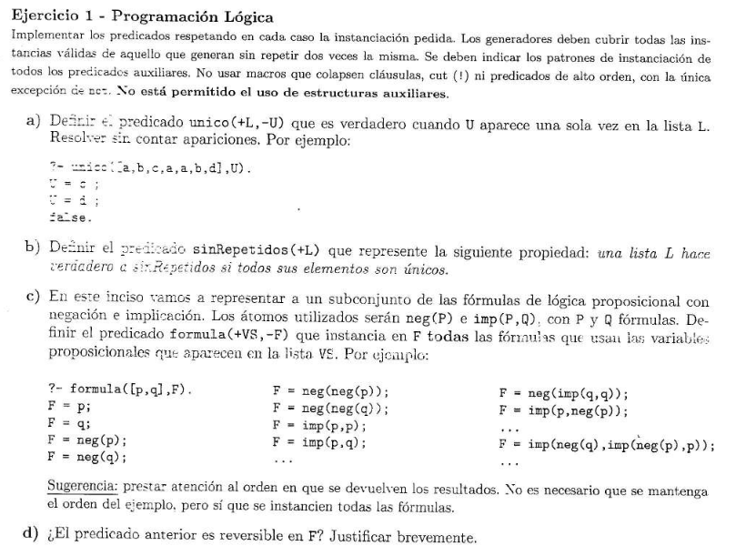
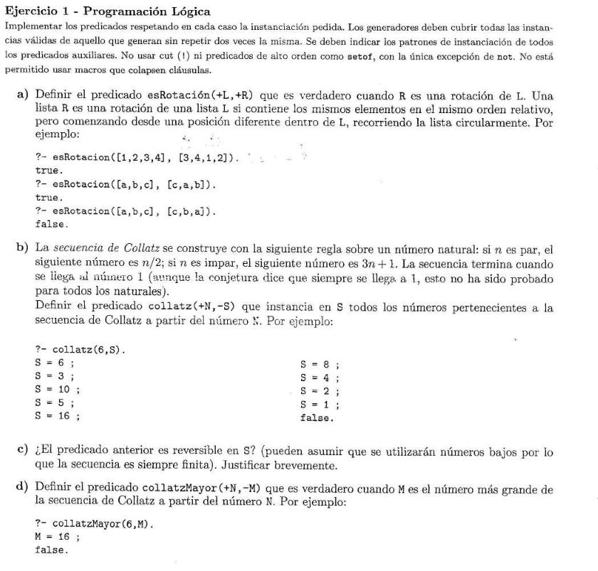
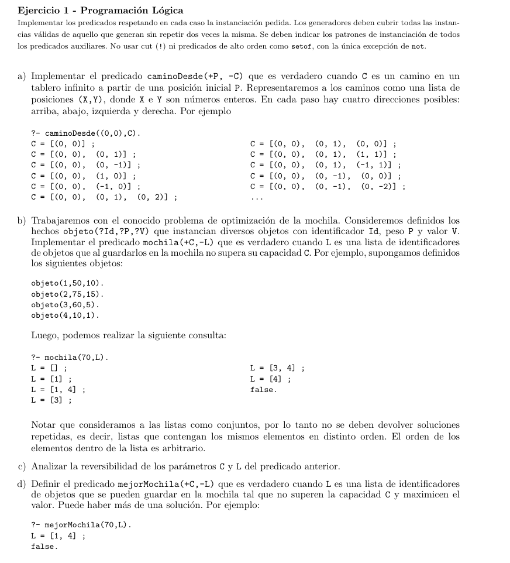
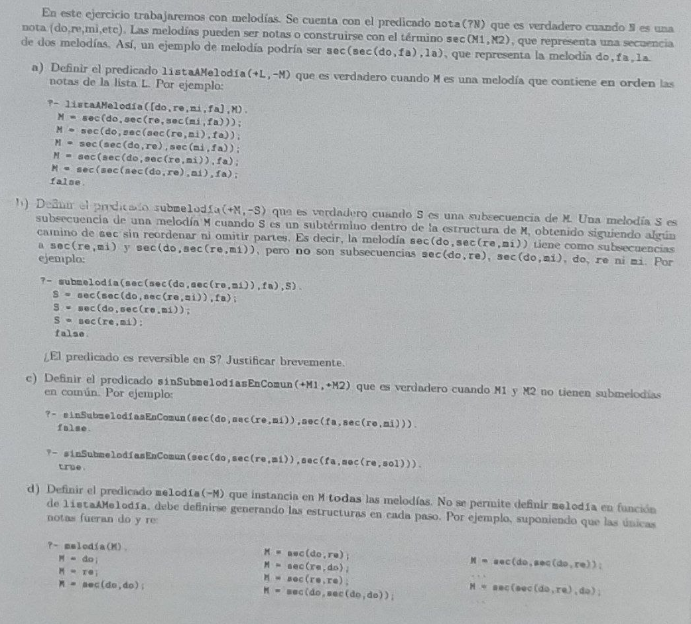
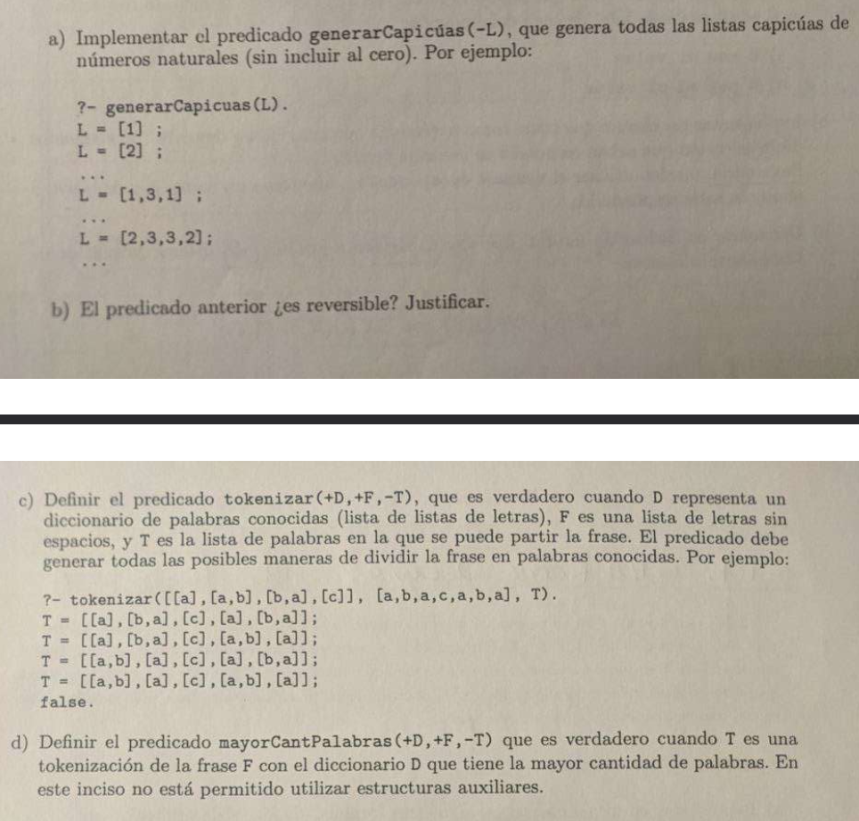
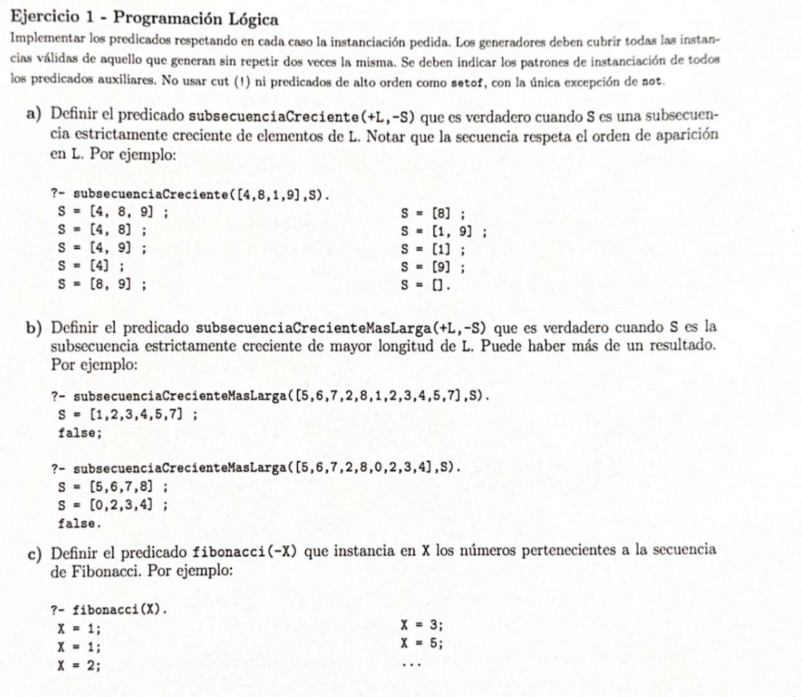

# Repaso de parciales - Prolog

## Observaciones

- En dos parciales de los de abajo se repite un patrón: hacer un predicado/2 principal que sea un generador de naturales (`between(0, inf, _nombre_)`) que llama a un predicado/3 auxiliar donde uno de los parámetros está controlado por ese `_nombre_`, el cual puede ser una cantidad de pasos o algo similar. Dentro del auxiliar se determinan **todas** las restricciones o casos que debe pasar el programa para que **no** se cuelge en un paso puntual de forma infinita (ver [formulasConNSubformulas](#ej-3), [caminoDeNPasos](#ej-1-2) y [melodiaDeNTerm](#ej-4)). Esto es lo que se conoce como [**Iterative deepening**](https://en.wikipedia.org/wiki/Iterative_deepening_depth-first_search).

---

## Recu - 1C25




###  Ej 1

```prolog
unico(L, U) :- 
    select (U, L, Resto),       % Saco a U de L, devuelvo Resto, que es la lista L sin U
    not(member(U, Resto)).      % Me fijo si en Resto aparece nuevamente U
```

###  Ej 2

```prolog
sinRepetidos([]).               % La lista vacía no tiene repetidos
sinRepetidos([H|T]) :-
    not(member(H, T)),          % Veo que H (head) no pertenezca a T (tail)
    sinRepetidos(T).            % Llamo a la función con Tail para la recursión 

% Posible solución que veo más rebuscada
% sinRepetidos(L)  :- not(noEstaSolo(_, L)).
% noEstaSolo(X, L) :- member(X, L),
%                    not(unico(L, X)).
```

<div class="page"/>

###  Ej 3

```prolog
formulasConNSubformulas(1, VS, F)           :- member(F, VS).                           % Caso base
formulasConNSubformulas(N, VS, neg(F))      :- N > 1,                                   % Ej: Si N = 2
                                               N1 is N - 1,                             % Ej: => N1 = 1
                                               formulasConNSubformulas(N1, VS, F).      % Ej: formulasConNSubformulas(1, VS, F). Previamente se corrió formulasConNSubformulas(N, VS, neg(F)), por lo que el F resultante de la primera unifica y genera neg(F) 
formulasConNSubformulas(N, VS, imp(FP, FQ)) :- N > 2,                                   % Ej: Si N = 4
                                               N1 is N - 1,                             % => N1 = 3
                                               between (1, N1, NIzq),                   % between(1, 3, NIzq). En NIzq guardo las combinaciones 1 = NIzq, 2 = NIzq, 3 = NIzq.
                                               NDer is N1 - NIzq,                       % Genero las combinaciones para NDer: NDer = 3 - 1, NDer = 3 - 2, NDer = 3 - 3.
                                               formulasConNSubformulas(NIzq, VS, FP),   % Llamo a las fórmulas P con la cantidad de NIzq (paso recursivo)
                                               formulasConNSubformulas(NDer, VS, FQ).   % Llamo a las fórmulas Q con la cantidad de NDer (paso recursivo)

formula(VS, F) :- between(0, inf, N),                   % Primero prueba N=1, luego N=2...
                  formulasConNSubformulas(N, VS, F).    % Genera fórmulas de ese tamaño exacto
```

---

## Parcial - 1C25



###  Ej 1

```prolog
esRotacion(L, R) :-
    length(L, Len),     % Chequeo que las longitudes de ambas listas sean iguales
    length(R, Len),     % Chequeo que las longitudes de ambas listas sean iguales
    append(L1, L2, L),  % Divido a L en 2 partes: L1 y L2. Acá digo que L es la lista resultante de hacer append de L1 y L2
    append(L2, L1, R).  % Chequeo que R sea la lista resultante de hacer append de de L2 y L1 (o sea, la lista L inversa)
```

###  Ej 2

```prolog
collatz(1, [1]).                % Caso base, cuando se llega a 1 termina.
collatz(N, [N|Resto]) :-        % Caso N par
    N > 1,
    N mod 2 =:= 0,              % Veo que sea par
    Sig is N // 2               % Sig = n/2
    collatz(Sig, Resto).        % Paso recursivo
collatz(N, [N|Resto]) :-        % Caso N impar
    N > 1,
    N mod 2 =\= 0,              % Veo que sea impar
    Sig is 3*N+1,               % Sig = 3*N+1
    collatz(Sig, Resto).        % Paso recursivo
```

###  Ej 3

```prolog
collatzMayor(N, Max) :-
    collatz(N, L),              % Hago collatz con N, devuelvo la lista L
    maximo_lista(L, Max)        % Busco el máximo en la lista L


maximo_lista([X], X).           % Si la lista tiene un solo elem, ese es el máximo
maximo_lista([H|T], Max) :-
    maximo_lista(T, MaxResto),  % Calculo el máximo del tail, lo guardo como MaxResto
    Max is max(H, MaxResto).    % Ahora a Max le doy el valor del máximo entre el head y el máximo del tail (MaxResto)

```

---

<div class="page"/>

## Recu - 2C24



###  Ej 1

```prolog
% Primero tengo que definir cómo se comportarán los pasos de acuerdo a los movimientos, defino:

paso((X, Y), (X, Y1)) :- Y1 is Y + 1.  % Arriba
paso((X, Y), (X, Y1)) :- Y1 is Y - 1.  % Abajo
paso((X, Y), (X1, Y)) :- X1 is X + 1.  % Derecha
paso((X, Y), (X1, Y)) :- X1 is X - 1.  % Izquierda

% Tengo que controlar la cant. de pasos porque sino puede seguir infinitamente para un lado y nunca encontrar caminos

caminoDeNPasos(P, [P], 0).              % El camino tiene 0 pasos, entonces la pos. inicial = camino
caminoDeNPasos(P, [P|T], Pasos) :-
    Pasos > 0,
    PasosT is Pasos - 1,                % El LargoT (largo tail) es el largo restante, como recorro solo H, es -1.
    paso(P, Sig),                       % Sigo al próximo paso
    caminoDeNPasos(Sig, T, PasosT).     % Llamo a la función con el nuevo paso, el tail de la lista y la cantidad de pasos restantes

% Ahora que tengo una forma de controlar los casos donde Pasos = 0 y Pasos > 0, además de que cambio la operación de movimientos de 'paso', puedo llamar a la original

caminoDesde(P, C) :-
    between(0, inf, Pasos),             % Genero pasos (núms naturales) de 0 a inf
    caminoDeNPasos(P, C, Pasos).        % Llamo a la auxiliar para que corra infinitamente
```
### Ej 2

```prolog
mochila(Capacidad, IDs) :-
    mochila(Capacidad, 0, IDs).

mochila(_, _, []).                      % La lista vacía siempre es válida
mochila(Capacidad, MinID, IDs) :-       
    objeto(ID, Peso, _),                % Declaro el objeto con su ID y Peso, el valor no interesa
    Capacidad >= Peso,                  % La capacidad de la mochila _debe_ ser mayor al peso del obj
    
    ID >= MinID,                        % El ID del obj debe ser mayor o igual al minID que actua de "filtro" o iterador para que no haya duplicados

    NuevaCapacidad is Capacidad - Peso, % Declaro NuevaCapacidad para hacer el llamado rec
    NextMinID is ID + 1,                % NextMinID será el próximo ID (como un iterador, filtro) para el llamado rec
    mochila(NuevaCapacidad, NextMinID, RestoIDs).   % Llamado rec
```

### Ej 3

Acá voy a necesitar definir 2 predicados más para poder definir cuándo una mochila es mejor que otra y para determinar el valor total de una mochila

```prolog
valorMochila([], 0).                    % Si la mochila no tiene elems, su valor es 0
valorMochila([ID|RestoIDs], Valor) :-
    objeto(ID, _, ValorObj),            % En este caso no interesa la capacidad. Lo declaro para unificar
    valorMochila(RestoIDs, ValorRec),
    Valor is ValorObj + ValorRec.       % El valor devuelto es la suma del valor del obj + la recursión de valores

existeMochilaMejorValor(Capacidad, MochilaActual) :-
    valorMochila(MochilaActual, ValorOrigMochila),      % Calculo el valor de la mochila del predicado
    mochila(Capacidad, MejorMochila),                   % Genero otra mochila, que asumo es mejor
    MejorMochila \= MochilaActual,                      % Declaro que ambas son diferentes, sino no tendría sentido
    valorMochila(MejorMochila, ValorMejorMochila),      % Calculo el valor de la nueva mochila que supuestamente es mejor
    ValorMejorMochila > ValorOrigMochila.               % El predicado devuelve 'true' si ∃ MejorMochila tq ValorMejorMochila > ValorOrigMochila

mejorMochila(Capacidad, Mochila) :-
    mochila(Capacidad, Mochila),
    not(existeMochilaMejorValor(Capacidad, Mochila)).
```
---

<div class="page"/>

## Parcial - 2C25



### Ej 1

```prolog
listaAMelodia([M], M).                  % Caso base, la lista es solo una melodía
listaAMelodia(L, sec(M1, M2)) :-
    append(L1, L2, L),                  % Divido L en L1 y L2
    L1 \= [],                           % Me aseguro que L1 no sea vacía
    L2 \= [],                           % Me aseguro que L2 no sea vacía
    listaAMelodia(L1, M1),              % M1 va a contener todas las melodías L1
    listaAMelodia(L2, M2).              % M2 va a contener todas las melodías L2

% El input [do, re, mi, fa] devuelve:
% sec(do, sec(re, sec(mi, fa)))
```

### Ej 2

```prolog
submelodia(sec(M1, M2), sec(M1, M2)).           % Caso base, son exactamente la misma secuencia
submelodia(sec(M1, _), S) :- submelodia(M1, S). % Caso donde S es submelodia de M1
submelodia(sec(_, M2), S) :- submelodia(M2, S). % Caso donde S es submelodia de M2
```

<div class="page"/>

### Ej 3

```prolog
sinSubMelodiasEnComun(M1, M2) :-
    not((submelodia(M1, S), submelodia(M2, S))).  % Si S es submelodia de ambas, se devolverá 'true'. Con el not, devuelve 'false'.

% Va con un paréntesis de más (encerrando ambas submelodías) porque not es not/1, no admite 2 args
```

### Ej 4

```prolog
melodia(M) :-
    between(1, inf, N),             % Genero nats desde 1 -> ∞
    melodiaDeNTerm(N, M).           % Llamo a la aux para generar infinitamente

melodiaDeNTerm(1, M) :- nota(M).    % El caso tiene 1 solo término (una nota), devuelvo esa nota
melodiaDeNTerm(N, sec(M1, M2)) :-   
    N > 1,                          % Me aseguro de no caer en el caso base
    N1 is N-1,                      % Dejo al menos un elem para M2
    between(1, N1, NMelo1)          % Calculo todas las combinaciones para M1 
    NMelo2 is N-NMelo1,             % Le doy a NMelo2 el resto de los elementos. Ej: Si NMelo1 = 2 y N = 5 ⇒ NMelo2 = 3 
    melodiaDeNTerm(NMelo1, M1),     % Llamo a M1 con su N
    melodiaDeNTerm(NMelo2, M2).     % Llamo a M2 con su N
```

## Parcial - 1C24



<div class="page"/>

### Ej 1

```prolog
generarCapicuas(L) :-
    between(1, inf, N),         % genero N = 1 -> inf
    listaQueSuma(N, L),         % llamo al generador de listas que suman N
    reverse(L, L).              % verifico que sea capicua

listaQueSuma(0, []).            % si la lista suma 0 => es la vacía
listaQueSuma(N, [H|T]) :-       
    N > 0,                      % me aseguro que N > 0
    between(1, N, H),           % genero N = 1 -> inf y los pongo en la pos de H
    Resto is N - H,             % calculo Nresto
    listaQueSuma(Resto, T).     % llamo al tail con nresto
```

`generarCapicuas(L)` _no_ es reversible. Por ejemplo, si se hace `generarCapicuas([1,2])`: `between(1, inf, N)` calcula los N -> `listaQueSuma(N, [1,2])` va a verificar si [1,2] suma 1 -> 'false' -> verifica si suma 2 -> 'false' -> verifica si suma 3 -> 'true' -> `reverse([1,2], [1,2])` devuelve 'false' -> va a seguir calculando si suma 4, 5, 6, etc y siempre va a dar 'false', nunca termina.

### Ej 2

```prolog
tokenizar(_, [], []).
tokenizar(Dic, F, [H|T]) :-
    member(H, Dic),             % elijo un elem perteneciente al dic
    append(H, RestoF, F),       % verifico que F empiece con H. declaro RestoF como el tail de F para la rec
    tokenizar(Dic, RestoF, T).  % rec con Dic, el resto de la lista y el tail de tokens
```

### Ej 3

```prolog
mayorCantPalabras(D, F, T) :-
    tokenizar(D, F, T)          % candidato T
    length(T, N)                % calculo su tamaño
    not((
        tokenizar(D, F, T2),        % candidato T2
        length(T2, N2)              % calculo tamaño T2
        N2 > N)).

% Se lee como "Si existe T, no existe T2 tal que (y lo de adentro del not)".
```

---

<div class="page"/>

## Parcial - 2C24



### Ej 1

```prolog
subsecuenciaCreciente(L, S) :-
    subsecuencia(L, S),
    esCreciente(S).

% Lista1 = L1 = [H|T1], Lista2 = L2 = [H|T2] 

subsecuencia([], []).
subsecuencia([H|T1], [H|T2]) :-
    subsecuencia(T1, T2).
subsecuencia([_|T1], L2) :-
    subsecuencia(T1, L2).

esCreciente([]).
esCreciente([_]).
esCreciente([A,B|T]) :-
    A < B,
    esCreciente([B|T]).
```

<div class="page"/>


### Ej 2

```prolog
subsecuenciaMasLarga(L, S) :-
    subsecuenciaCreciente(L, S),       % candidato S1
    length(S, N1), 
    not((
        subsecuenciaCreciente(L, S2),   % candidato S2
        length(S2, N2),
        N2 > N1
    )).
```

### Ej 3

```prolog
fibonacci(X) :-
    fibonacci_aux(0, 1, X).

fibonacci_aux(_, Act, Act).
fibonacci_aux(Ant, Act, X) :-
    Siguiente is Ant + Act,
    fibonacci_aux(Act, Siguiente, X).
```

`fibonnaci(X)` _no_ es reversible porque si se le pasa un X, sería algo así: `fibonnaci(5)` -> Prolog genera 1, 1, 2, 3, 5 -> Devuelve 'true' -> Si se le pide más soluciones (con ; ), va a seguir generando números y se va a colgar porque los números no paran de crecer y no va a encontrar otra vez al 5. Lo mismo pasa con todos los números