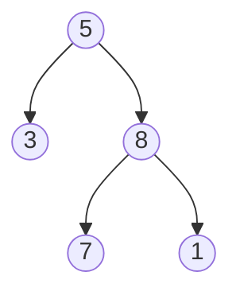
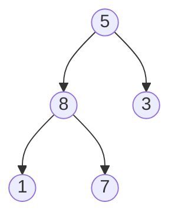

## Función elem
1. Implementar la función "elem" que dice si un elemento pertenece, o no, a una lista.

```haskell
elem :: Eq a => a -> [a] -> Bool
elem e = foldr (\x rec -> x == e || rec) False
```

Otra forma de hacerlo:

```haskell
elem2 :: Eq a => a -> [a] -> Bool
elem2 e = foldr ((||).(==e)) False
```

## Función take
2. Implementar la funcion `take :: Int -> [a] -> [a]`

take toma los n elementos de una lista.
Primero se trata de implementar `take :: [a] -> Int -> [a]

```haskell
take' :: [a] -> Int -> [a]
take' [] _ = []
take' (x:xs) n = if n == 0 then [] else x : take' xs (n-1)
```
Esto es recursión estructural, por lo que necesitamos el n para construir esta función. No es lo ideal.

Se puede reescribir así para sacarse de encima la n. Además, notar el uso de const, queda más declarativo.

```haskell
take'' :: [a] -> Int -> [a]
take'' [] = const []
take'' (x:xs) = \n -> if n == 0 then [] else x : take'' xs (n-1)
```

Versión con foldr

```haskell
take''' :: [a] -> Int -> [a]
take''' = foldr (\x rec -> \n -> if n==0 then [] else x : rec (n-1)) (const [])
```

```
1. take [1, 2] 1
2. foldr f const[] [1,2] 1
3. f 1(foldr f(const [])) [2] 1
4. \n -> f n == 0 then [] else 1.(foldr f(const[]) [2] (n-1))
5. if n == 0 then [] else 1.(foldr f(const[]) [2] 0)
6. 1. foldr f(const[]) [2] 0
7. 1.(\n -> if n == 0 then [] else 2(foldr f(const) [x-1])) 0
```

Los pasos se ven algo así _(copiado muy dudosamente del pizarrón)_. Hay pasos salteados.

## ¿Qué es lo que hace rec?

Rec es la recursión.

"A `rec`-block tells the compiler where precisely the recursive knot should be tied. It turns out that the placement of the recursive knots can be rather delicate: in particular, we would like the knots to be wrapped around as minimal groups as possible" [Fuente](https://ghc.gitlab.haskell.org/ghc/doc/users_guide/exts/recursive_do.html#the-mdo-notation)

"`rec` is implemented using the `loop` function of `ArrowLoop`. It is defined as followed:
```haskell
class Arrow a => ArrowLoop a where
        loop :: a (b,d) (c,d) -> a b c

instance ArrowLoop (->) where
        loop f b = let (c,d) = f (b,d) in c
```
You can see: The output is just fed back as the input. It will be calculated just once, because Haskell will only evaluate `d` when it's needed." [Fuente](https://stackoverflow.com/questions/5405850/how-does-the-haskell-rec-keyword-work)

## Ejemplos de recursión global

Recordatorio: permite definir funciones donde la llamada recursiva no necesariamente es sobre un argumento “más chico” de forma obvia.
**No siempre garantiza terminación**.

```haskell
listasQueSuman :: Int -> [[Int]]
listasQueSuman 0 = [[]]
listasQueSuman n | n > 0 = [x:xs | x <- [1..n], xs <- listasQueSuman (n-x)]
```

Lo que hace esta función es devolver una lista de listas que suma n-x. 
Esta función es **parcial**, ya que para números n =< 0 no funciona.

Ejemplo de funcionamiento:
```haskell
listasQueSuman 3
= [[1,1,1], [1,2], [2,1], [3]]
```

Otro ejemplo, con fibonacci

```haskell
fibonacci : Int -> Int
fibonacci 0 = 1
fibonacci 1 = 1
fibonacci n | n > 1 = fibonacci (n-1) + fibonacci (n-2)
```
## Ejemplo de función primitiva

Recordatorio: todas las funciones primitivas recursivas **terminan siempre**, pero no todas las funciones computables son primitivas

```haskell
fact :: Int -> Int
fact 0 = 1
fact n | n > 0 = n * fact(n-1)
```

Esta función termina siempre, ya que `fact 0 = 1` y `fact(n+1) = (n+1) * fact(n)`. La función decrece siempre.
Esta también es una función **parcial**.

## Función pares
3. Implementar `pares :: [(Int, Int)]`, una lista finita que no tenga repetidos.

Para generar las listas se puede usar la función listasQueSuman que se definió antes.
```haskell
listas :: [[Int]]
listas = [xs | n <- [1..], xs <- listasQueSuman n]
```

Otra forma de implementarlo:

```haskell
listas2 :: [[Int]]
listas2 = concatMap listasQueSuman
```

## Recursión sobre otras estructuras

`data AEB a = Hoja a | Bin (AEB a) a (AEB a)`

Esto es un tipo inducto con un constructor _no recursivo_ y otro constructor _recursivo_

### ¿Cómo sería el foldr de esta estructura?

Si se tiene:
```haskell
data List a = [] | (a:List a)

foldr :: (a -> b -> b) -> b -> List a -> b
```

- Los tipos `(a -> b -> b)` se usan cuando se tiene algo del tipo `(a:List a)`.
- El tipo `b` se usa cuando se tiene algo del tipo `[]`.


Entonces:
```haskell
data AEB a = Hoja a | Bin (AEB a) a (AEB a)

foldAEB :: (b -> a -> b -> b) -> (a -> b) -> AEB a -> b
```

Cada árbol es de tipo **b** y queremos que el output sea también de punto b. La raíz es de tipo **a**. Por eso está estructurado así el primer paréntesis.

- Los tipos `(b -> a -> b -> b)` se usan cuando se tiene algo del tipo `Bin (AEB a) a (AEB a)` (la segunda parte del "or" del árbol, digamos).
- Los tipos `(a -> b)` se usan para cuando se tiene algo del tipo `Hoja a`.
- **AEB a** es nuestro árbol
- **b** será nuestro resultado

Teniendo este árbol de ejemplo, voy a tratar de definir una función **foldAEB** y **altura** respetando los tipos anteriores.



```haskell
ejemplo = Bin (Hoja 3) 5 (Bin (Hoja 7) 8 (Hoja 1))
  

foldAEB :: (b -> a -> b -> b) -> (a -> b) -> AEB a -> b
foldAEB fBin fHoja t = case t of
	Hoja n      -> fHoja n
	Bin t1 n t2 -> fBin (rec t1) n (rec t2)
where
	rec = foldAEB fBin fHoja

  
altura :: AEB a -> Int
altura = foldAEB (\ri _ rd -> 1 + (max ri rd)) (const 1) 
								-- caso base es el const

espejo :: AEB a -> AEB a
espejo = foldAEB (\recI r recD -> Bin recD r recI) Hoja
```

- Si hago: `altura ejemplo = 3`.

- Si hago `print (espejo ejemplo)`:


