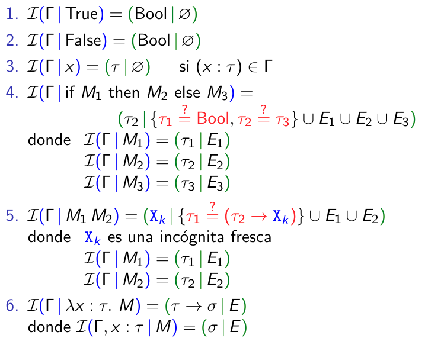

# Unificación e inferencia de tipos

## Lecturas recomendadas

| Inferencia de tipos                       | Unificación                                             |
| ----------------------------------------- | ------------------------------------------------------- |
| [Cap. 22 de Pierce](../Recursos/Teo6.pdf) | [Secc. 4.6 de Baader & Nipknow](../Recursos/Teo6_2.pdf) |

---

## Problema de inferencia de tipos

> Se usará $U$ para términos **sin** anotaciones de tipos y se seguirá utilizando $M$ para términos **con** anotaciones de tipos.

- erase(M) será una función matemática que dado un término **con** anotaciones de tipos, devuelve un término **sin** anotaciones de tipos.

Un término $U$ **sin** anotaciones de tipos es tipable sii existen:
- un contexto de tipado **Γ**
- un término con anotaciones de tipos $M$
- un tipo **τ**

```haskell
(X1 → Bool) ≟ ((Bool → Bool) → X2)
    ⇒X1 := (Bool → Bool) y X2 := Bool

(X1 → Bool) ≟ X1
    no tiene solución
```

## Algoritmo de unificación

### Unificación

$$X_{k_{i}} := \tau_1,...\ ,X_{k_{n}} := \tau_n$$

Es la sustitución **S** tal que $S(X_{k_{i}})$ = τᵢ para cada 1 ≤ i ≤ n y además $S(X_{k})$ = Xₖ para cualquier otra incógnita.

Si τ es un tipo, se escribe S(τ) para el resultado de reemplazar cada incógnita de τ por el valor que le otorga **S**.

Un **unificador** para $E$ 

$$E = {\tau_1 ≟ \sigma_1, \tau_2 ≟ \sigma_2, ... \ ,\tau_n ≟ \sigma_n}$$

es una sustitución **S** tal que
$$S(\tau_1) = S(\sigma_1), S(\tau_2) = S(\sigma_2), ... \ , S(\tau_n) = S(\sigma_n)$$

---

Se puede hcaer la siguiente composición:

$$S_B = S_C \circ S_A$$

Teniendo en cuenta que:

- $S_A$ :: Incógnita → Tipo
- $S_B$ :: Incógnita → Tipo
- $S_C$ :: Incógnita → Tipo

Y que Incógnita ⊆ Tipo. Si no se tiene en cuenta esto último, "_no tiparía_" en Haskell.

★ Es una composición que se comporta de la siguiente forma: $S_B(X_i) = S_C(S_A(X_i))$

∴ Se puede afirmar que una sustitución **$S_A$** es **más general** que una sustitución **$S_B$** si **$S_B$** se obtiene instanciando variables de **$S_A$**.

Si tengo: 

```haskell
S1 = {X1 := Bool, X2 := (Bool → Bool)}
S2 = {X1 := Int, X2 := (Int → Bool)}
S3 = {X1 := X3, X2 := (X3 → Bool)}
S4 = {X2 := (X1 → Bool)}
```

S₁, S₂ y S₃ no son ninguna más general que la otra. S₄ es más general que todas las demás y ninguna es más general que ella. Se puede probar haciendo la sustitución ★.

### Algoritmo de unificación de Martelli-Montanari

```haskell
{Delete}                          {Xₙ ≟ Xₙ} ∪ E  ⟶  E
{Decompose}    {C(τ₁...,τₙ) ≟ C(σ₁,...,σₙ)} ∪ E  ⟶  {τ₁ ≟ σ₁,...,τₙ ≟ σₙ} ∪ E
{Swap}                             {τ ≟ Xₙ} ∪ E  ⟶  {Xₙ ≟ τ} ∪ E,             -- si τ no es una incógnita
{Elim}                             {Xₙ ≟ τ} ∪ E  ⟶  E' = {Xₙ := τ}(E),        -- si Xₙ no ocurre en τ
{Clash}       {C(τ₁...,τₙ) ≟ C'(σ₁,...,σₙ)} ∪ E  ⟶  falla,                    -- si C ≠ C'
{Ocurrs-check}                     {Xₙ ≟ τ} ∪ E  ⟶ falla,                     -- si Xₙ ≠ τ y Xₙ ocurre en τ
```

#### Teorema - Corrección del Algoritmo de M-M

1. El algoritmo termina para cualquier problema de unificaión $E$
2. Si $E$ no tiene solución, el agoritmo llega a una `falla`
3. Si $E$ tiene solución, el algoritmo llega a ∅:

$$E = E_0 \rightarrow_{S_1}, E_1 \rightarrow_{S_2}, E_2 \rightarrow ... \rightarrow_{S_n}, E_n = \emptyset $$

Además, $S = S_n◦...◦ S_2◦S_1$ es un unificador para $E$. Dicho **unificador** es el **más general** posible (salvo renombre de incógnitas), el cual será notado como $mgu(E)$


---

#### Ejemplo 1

$${(x_2 → (x_1 → x_1)) ≟ ((Bool → Bool) → (x_1 → x_2))}$$

```haskell
{Decompose} {x2 ≟ B -> B, x1 -> x1 ≟ x1 -> x2}  -- acá habría una sustitución pero es la id
{Elim}      {x1 -> x1 ≟ x1 -> B -> B}           -- acá tuve en cuenta que x2 := B -> B
{Decompose} {x1 ≟ x1, x1 ≟ B -> B}              -- acá habría una sustitución pero es la id
{Delete}    {x1 ≟ B -> B}                       -- acá habría una sustitución pero es la id
{Elim}      ∅                                   -- acá tuve en cuenta que x1 := B -> B

∴ E tiene solución y mgu(E) = {x1 := B -> B} ∘ {x2 := B -> B} = { x1 := B -> B, x2 := B -> B}
```

---

#### Ejemplo 2

$${x_1 ≟ (x_2 → x_2), x_2 ≟ (x_1 → x_1)}$$

```haskell
{Elim}          {x2 ≟ (x2 -> x2) -> x2 -> x2}            -- acá tuve en cuenta que x1 := x2 -> x2
{Occurs-check}  FALLA

∴ E no tiene solución, por lo que mgu(E) no está definido
```

## Algoritmo ℑ (de inferencia de tipos)

### Paso 1: Rectificación

Se dice que un término está _rectificado_ si:

1. No hay dos variables ligadas con el mismo nombre. 
2. No hay una variable ligada con el mismo nombre que una variable libre.

> Siempre se puede rectificar un término α-renombrándolo

---

### Paso 2: Anotación

Se tiene un término $U$, que se supone ya está rectificado.

Se produce un contexto $\Gamma_0$ y un término $M_0$

1. El contexto $\Gamma_0$ le da tipo a todas las variables libres de $U$. El tipo de cada variable es una incógnita fresca.
2. El término $M_0$ está anotado de tal modo que erase($M_0$) = $U$. Todas las anotaciones son incógnitas frescas.

---

### Paso 3: Generación de las restricciones

Se tiene un contexto $\Gamma$ y un término $M$ con anotaciones de tipos.

Recursivamente se calcula:

1. Un tipo τ, que corresponde al tipo de $M$
2. Un conjunto de ecuaciones $E$. Representan restricciones para que $M$ esté bien tipado.

---

A partir de lo anterior, se define el algoritmo recursivo:

$$\Im(\Gamma \ | \ M) = (\tau \ | \ E)$$

donde:

- lo de la izquierda es la entrada y lo de la derecha la salida.
- Γ = contexto, $M$ = término, τ = tipo, $E$ = restricciones.

---

#### Definición de las restricciones

[](../Teorica6.pdf#page-21)

---

### Paso 4: Unificación de las restricciones

Una vez calculado $\Im(\Gamma_0 \ | \ M_0)$:
1. Se calcula **S** = mgu($E$)
2. Si no existe el unificador, el término $U$ **no** es tipable.
3. Si existe el unificador, el término $U$ **es** tipable y vale el siguiente **_juicio de tipado_**:
   $$S(\Gamma_0) \vdash S(M_0) : S(\tau)$$

---

### Teorema - Corrección del Algoritmo ℑ

Nuevamente, vale lo que se indicó anteriormente, en el [Paso 4](#paso-4-unificación-de-las-restricciones).

El **_juicio de tipado_** es el **más general posible** para $U$.

Además, con mayor precisión, si Γ' ⊢ $M$' : τ' es un jucio válido y erase($M$') = $U$, existe una sustitución **S**' tal que:

- Γ' ⊇ **S**'(Γ₀)
- $M$' = **S**'($M$₀)
- τ' = **S**'(τ)

#### Ejemplo 1

$$U = λx. λy. yx$$

1. Ya está rectificado
2. 
   1. Γ₀ = ∅
   2. $M$₀ = λx: X1. λy: X2. yx 
3.

```haskell
    ℑ(∅ | λx: X1. λy: X2. yx)   = (X1 -> X2 -> X3 | E)
    |
    ℑ(x:X1 | λy: X2. yx)        = (X2 -> X3 | E)
    |
    ℑ(x:X1, y:X2 | yx)          = (X3 | {X2 ≟ X1 -> X3}), donde {X2 ≟ X1 -> X3} = E
    |
    |- ℑ(x:X1, y:X2 | y)        = (X2 | ∅)
    |
    |- ℑ(x:X1, y:X2 | x)        = (X1 | ∅)

    La parte izquierda se resuelve de arriba hacia abajo y la derecha de abajo hacia arriba

    ∴ ℑ(Γ₀ | M₀) = (X1 -> X2 -> X3 | {X2 ≟ X1 -> X3})
 ```
 
4. $mgu(E) = \{ X2 := X1 \rightarrow X3 \}$
   1. ∴ $U$ es tipable
   2. El juicio de tipado mśa general que le da tipo a $U$ es: $S(\emptyset) \ \vdash \ S(M_0) : S(X1 \rightarrow X2 \rightarrow X3)$
