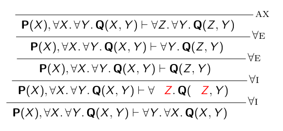
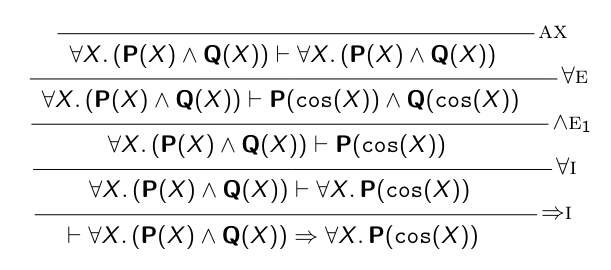
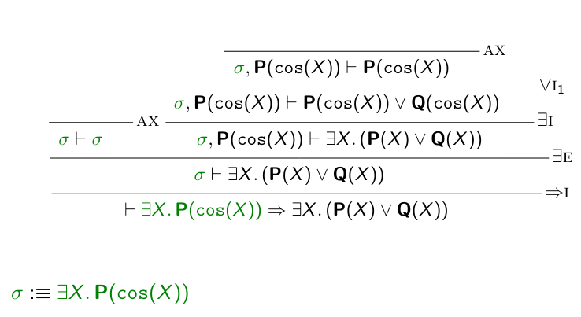
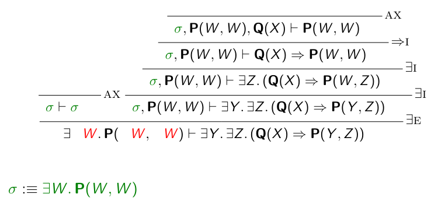

# Lógica de primer orden

## Sintaxis de la lógica de primer orden

Un lenguaje $L$ de primer orden está dado por:

1. Un conjunto de símbolos de funcion $F$ = `{f, g, h, ...}`
2. Un conjunto de símbolos de predicado $P$ = `{P, Q, R, ...}`

Ambos símbolos con aridad ≥ 0.

### Términos de primer orden

Un conjunto $T$ de términos se define por la siguiente gramática:

$$t ::= x \ | \ f(t_1,...,t_n)  $$

donde:

- $x$ denota una variable
- $f$ denota un símbolo de funcion con aridad ≥ 0

Se puede interpretar la **_aridad_** como "cuántos elementos se le pasan al símbolo"

### Ejemplo de términos sobre el lenguaje Lₐᵣᵢₜₘ

$$+(0,succ(x))$$

$$*(+(x,y),z)$$

### Fórmulas de primer orden

★ Tener cuidado: evitar la captura de variables, al igual que en _cálculo λ_

## Deducción natural para lógica de primer orden

### Deducción natural

- **Contexto**: Γ
- **Secuente**: Γ ⊢ σ

(lo mismo que λ)

Acá dejo el [machete](../../Recursos/Machete-DNatLPO.pdf) de las reglas de deducción natural pero en LPO.

---

- $I$ = regla de introducción
  - $X \notin fv(\Gamma)$ significa que X no aparezca como _variable libre_ en el contexto, es decir, que no haya condiciones que limiten la variable dentro de la deducción de una regla en ese contexto. En este caso es usado en la definición de $\forall_I$.
- $E$ = regla de eliminación
  - $X \notin fv(\Gamma, τ)$ sigue la misma noción que lo anterior. En este caso es usado en la definición de $\exists_E$.

#### Ejemplos de la teórica

##### Cuantificación universal

##### Cuantificación existencial

